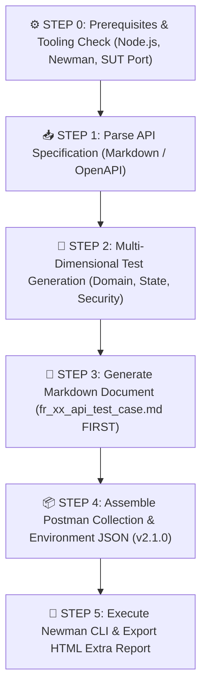

# AGENT SKILL: AI-DRIVEN API TEST GENERATOR FOR SUT

## 🌟 GIỚI THIỆU & NGUYÊN TẮC CỐT LÕI (CORE PRINCIPLES)

Skill này được thiết kế để tự động hóa toàn bộ quy trình kiểm thử API theo cấp độ chuyên gia (Level G9.5 Create theo chuẩn Bloom-AI). Toàn bộ quy trình tuân thủ nghiêm ngặt **3 Nguyên tắc Kỹ thuật**:

> [!IMPORTANT]
> 1. **Strict Pure Black-Box Testing:** Tuyệt đối không đọc, duyệt hay tìm kiếm mã nguồn nội bộ của Backend SUT (`/backend`, controllers, models, server.js). Mọi kịch bản kiểm thử bắt buộc phải được suy diễn 100% từ tài liệu Bảng đặc tả nghiệp vụ (API Specification) do người dùng cung cấp.
> 2. **Clean Execution Environment:** Tuyệt đối không tạo các script tạm thời hoặc file rác trong quá trình thực thi. Toàn bộ logic phải nằm trọn vẹn trong Universal Engine.
> 3. **Sequential Pipeline (Single Source of Truth):** Bắt buộc tuân thủ đúng thứ tự thác nước: **Đọc Spec $\rightarrow$ Xuất file Markdown Test Cases (`fr_xx_api_test_case.md`) $\rightarrow$ Đóng gói Collection JSON & Environment $\rightarrow$ Chạy Newman CLI $\rightarrow$ Xuất Báo cáo HTML.**

---

## 🔄 QUY TRÌNH THỰC HIỆN 5 BƯỚC (SEQUENTIAL PIPELINE)



---

### ⚙️ BƯỚC 0: KIỂM TRA MÔI TRƯỜNG & CÔNG CỤ (PREREQUISITES CHECK)
- Kiểm tra `Node.js >= 18.x / 20.x`.
- Kiểm tra `newman` và `newman-reporter-htmlextra` (tự cài đặt nếu thiếu).
- Kiểm tra cổng mạng SUT `http://localhost:3000` (không can thiệp vào mã nguồn backend).

---

### 📥 BƯỚC 1: TIẾP NHẬN & PHÂN TÍCH ĐẶC TẢ API (SPEC PARSING)
- Nhận file đặc tả API (ví dụ `api_specification_template.md` hoặc prompt).
- Trích xuất: Endpoint, HTTP Method (`GET/POST/PUT/DELETE`), Headers, Request Body Schema, Ràng buộc nghiệp vụ (C1..Cn), Expected Responses.

---

### 🧠 BƯỚC 2: TỰ ĐỘNG SUY DIỄN MA TRẬN KIỂM THỬ ĐA CHIỀU ($\ge 35$ TCs)
1. **Ma trận Nghiệp vụ (Business Rules Matrix):** Kiểm tra tổ hợp điều kiện thỏa mãn và vi phạm từng điều kiện đơn lẻ.
2. **Domain Partitioning & BVA:** Min, Min-1, Min+1, 0, Negative, Max 32-bit, Decimal, Empty string `""`, Whitespace, Long string 5000 ký tự, Missing required field, Type confusion.
3. **Security Testing (SEC-01..07):** SQL Injection (`' OR '1'='1`, `DROP TABLE`), Missing Auth (401), Malformed JWT, IDOR (403), Parameter Tampering, Information Disclosure (SEC-07).
4. **Schema & SLA Benchmark:** Xác thực JSON Schema và Response time SLA < 500ms.

---

### 📄 BƯỚC 3: XUẤT TÀI LIỆU MARKDOWN TEST CASE SPECIFICATION (SOURCE OF TRUTH)
- **Bắt buộc tạo file Markdown trước:** Tạo file `${feature_slug}_api_test_case.md` tại thư mục gốc.
- Bảng mô tả chi tiết 6 cột: `TestID`, `Tên Test Case`, `Kỹ thuật áp dụng`, `Tham số / Payload`, `Expected Status`, `Assertions Kỳ Vọng`.

---

### 📦 BƯỚC 4: ĐÓNG GÓI POSTMAN COLLECTION & ENVIRONMENT JSON (v2.1.0)
- Đọc dữ liệu từ ma trận kịch bản đã sinh để tạo file `postman/${feature_slug}_collection.json`.
- Tự động tiêm Pre-request script Watermark: `X-Student-Id: {StudentID}`.
- Tự động sinh mã động Timestamp `Date.now()` đảm bảo tính Bất biến (Idempotency).
- Tự động cập nhật `postman/eshop_environment.json`.

---

### 🚀 BƯỚC 5: THỰC THI NEWMAN CLI & XUẤT BÁO CÁO HTML
- Chạy Newman tự động:
  ```bash
  npx newman run postman/${feature_slug}_collection.json \
    -e postman/eshop_environment.json \
    -r cli,htmlextra \
    --reporter-htmlextra-export reports/${feature_slug}_newman_report.html \
    --suppress-exit-code
  ```
- Xuất file báo cáo HTML Extra vào thư mục `reports/`.
