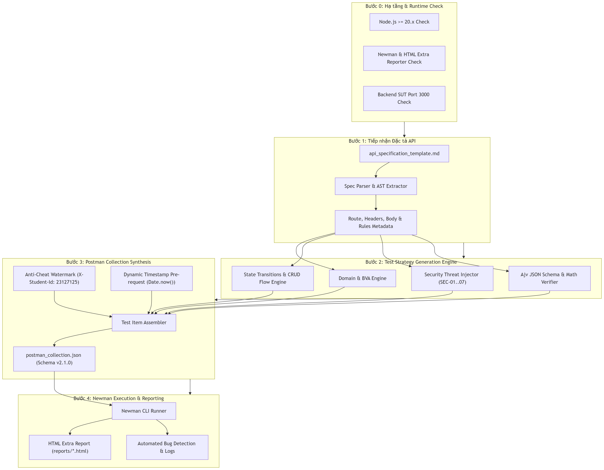

# THIẾT KẾ VÀ MÃ GIẢ THUẬT TOÁN AGENT SKILL: AI-DRIVEN API TEST GENERATOR
### Mục 7 Đề bài (Level G9.5 Create) — Tự Động Hóa Kiểm Thử API Chuyên Sâu
### Sinh viên thực hiện: Nguyễn Hiếu Thuận — MSSV: 23127125

---

## 1. MỤC TIÊU THIẾT KẾ (DESIGN OBJECTIVES)
Agent Skill được thiết kế theo mô hình **Engine Tự Động Khép Kín (Closed-loop Automation Engine)** với các mục tiêu:
1. **Kiểm tra Môi trường (Step 0):** Đảm bảo Node.js, Newman CLI và Backend SUT sẵn sàng trước khi thực thi.
2. **Phân tích Đặc tả Đa Nguồn:** Đọc tài liệu Markdown (`api_specification.md` / `api_specification_template.md`) hoặc OpenAPI JSON.
3. **Chiến lược Kiểm thử Toàn diện:** Tự động sinh kịch bản bao phủ Ma trận điều kiện (C1–C5), Phân vùng tương đương (Domain/BVA), Chuyển đổi trạng thái (CRUD State Flow), Bảo mật (SEC-01..07) và Schema.
4. **Đóng gói Chuẩn Postman v2.1.0:** Tự động tiêm Watermark Header `X-Student-Id: 23127125` và Timestamp động `Date.now()` (Idempotency 100%).
5. **Thực thi & Báo cáo Tự động:** Chạy Newman CLI và xuất báo cáo HTML Extra.

---

## 2. SƠ ĐỒ KIẾN TRÚC HỆ THỐNG (SELF-DRAWN MERMAID DIAGRAM)



---

## 3. MÃ GIẢ THUẬT TOÁN (PSEUDOCODE IN JAVASCRIPT/TYPESCRIPT STYLE)

```text
ALGORITHM ApiTestGeneratorAgentSkill(apiSpecFile, studentId, autoRun):
    INPUT: 
        apiSpecFile: File đường dẫn đặc tả API (Markdown hoặc JSON)
        studentId: Mã số sinh viên (mặc định: '23127125')
        autoRun: Cờ boolean cho phép tự động chạy Newman (true/false)
    OUTPUT: 
        postmanCollectionJson: File Postman Collection v2.1.0
        htmlReport: File báo cáo kiểm thử HTML Extra

    // ==========================================
    // STEP 0: PREREQUISITES CHECK
    // ==========================================
    ASSERT CheckNodeVersion() >= 18.0
    IF NOT IsCommandInstalled("newman") THEN
        ExecuteCommand("npm install -g newman newman-reporter-htmlextra")
    END IF
    IF NOT IsServerListening("http://127.0.0.1:3000") THEN
        LogWarning("SUT Backend chưa bật. Gợi ý: node server.js")
    END IF

    // ==========================================
    // STEP 1: SPEC PARSING
    // ==========================================
    specData = ParseMarkdownSpec(apiSpecFile)
    endpoint = specData.endpoint             // e.g. "/api/apply-coupon"
    method = specData.httpMethod             // e.g. "POST"
    rules = specData.businessRules           // e.g. C1..C5
    
    // ==========================================
    // STEP 2: TEST GENERATION
    // ==========================================
    testCases = []

    // 2.1. Ma trận Điều kiện Nghiệp vụ (Matrix Testing)
    FOR EACH rule IN rules:
        tcValid = CreateTestCase("Thỏa mãn " + rule.name, rule.validPayload, 200)
        tcInvalid = CreateTestCase("Vi phạm " + rule.name, rule.invalidPayload, rule.errorStatus)
        testCases.Add(tcValid, tcInvalid)
    END FOR

    // 2.2. Domain & Boundary Value Analysis (BVA)
    boundaries = [Min, Min - 1, Min + 1, 0, Negative, Float, Max32Bit]
    FOR EACH b IN boundaries:
        testCases.Add(CreateBvaTestCase(b.value, b.expectedStatus))
    END FOR

    // 2.3. Security Injections (SEC-01..07)
    testCases.Add(CreateSecurityTestCase("SQLi Payload", "' OR '1'='1", 400))
    testCases.Add(CreateSecurityTestCase("No Bearer Token", null, 401))
    testCases.Add(CreateSecurityTestCase("IDOR Tampered User", 999, 403))
    testCases.Add(CreateSecurityTestCase("Tampered Discount Field", 999999, 200))

    // 2.4. Schema & SLA Validation
    testCases.Add(CreateSchemaTestCase(specData.responseSchema, maxLatencyMs = 500))

    // ==========================================
    // STEP 3: ASSEMBLE POSTMAN COLLECTION
    // ==========================================
    collection = InitializeCollectionSchemaV2_1(specData.featureName, studentId)
    
    // Tiêm Pre-request Script Anti-AI-Cheat
    collection.AddPreRequestScript("pm.request.headers.upsert({ key: 'X-Student-Id', value: '" + studentId + "' });")
    
    // Gom nhóm kịch bản thành 5 sub-folders chuẩn
    FOR EACH tc IN testCases:
        postmanItem = BuildPostmanRequestItem(tc, method, endpoint)
        collection.AppendItemToFolder(tc.folderCategory, postmanItem)
    END FOR

    SaveJsonFile(collection, "postman/generated_collection.json")

    // ==========================================
    // STEP 4: EXECUTE NEWMAN CLI (OPTIONAL)
    // ==========================================
    IF autoRun == TRUE THEN
        reportFile = "reports/" + specData.featureCode + "_report.html"
        ExecuteCommand("npx newman run postman/generated_collection.json -e postman/eshop_environment.json -r cli,htmlextra --reporter-htmlextra-export " + reportFile)
        RETURN { collection, reportFile }
    END IF

    RETURN { collection }
END ALGORITHM
```
