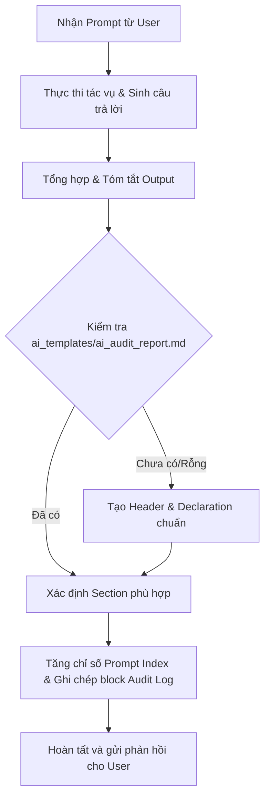

# Automation AI Audit Logs Skill (HW06 - API Testing)

Skill này quy định quy trình và tiêu chuẩn để Agent **luôn luôn tự động ghi nhận nhật ký tương tác (AI Audit Log)** vào file `ai_templates/ai_audit_report.md` sau mỗi lượt phản hồi cho người dùng, đảm bảo tính minh bạch, tính học thuật và tuân thủ 100% tiêu chí Anti-AI-Cheat của bài tập **HW06 - API Testing**.

---

## 1. MỤC TIÊU & NGUYÊN TẮC CỐT LÕI

1. **Tự động hóa hoàn toàn (Always-On Automation):** Sau khi xử lý xong câu lệnh của người dùng, Agent phải tự động cập nhật nhật ký mà không cần người dùng nhắc nhở.
2. **Trung thực & Nguyên bản (Prompt Integrity):** Lưu trữ chính xác, đầy đủ nội dung câu prompt của người dùng (kể cả các đường dẫn file, tham số đi kèm).
3. **Rút gọn & Đánh giá có cấu trúc (Concise AI Output Summary):** Phần phản hồi của AI (`Output`) phải được cô đọng thành các ý chính (bullet points), tóm tắt các quyết định kỹ thuật, mã nguồn đã sinh ra, phân tích hoặc giải pháp được đề xuất, không sao chép lại toàn bộ văn bản thô quá dài.
4. **Chuẩn hóa cấu trúc (HW06 Compliance):** Tuân thủ cấu trúc phân cấp Header, Section, Prompt Index, Metadata theo yêu cầu của HW06 - API Testing.

---

## 2. FILE ĐÍCH & QUY TẮC ĐỊNH VỊ

- **Đường dẫn file đích:** `ai_templates/ai_audit_report.md`
- **Khởi tạo ban đầu:** Nếu file `ai_templates/ai_audit_report.md` chưa tồn tại hoặc đang rỗng, Agent phải tự động khởi tạo phần tiêu đề chuẩn:

```markdown
# AI Audit Report & AI Critique - HW06 API Testing

---

## I. AI DECLARATION (TUYÊN BỐ SỬ DỤNG AI)

Tôi tuyên bố có sử dụng các công cụ AI (như Gemini 3.7 Flash, ChatGPT, Claude, Cursor) để hỗ trợ quá trình thực hiện bài tập HW06 - API Testing theo đúng quy định Guiding Principles của môn học. Toàn bộ các kết quả sinh ra từ AI đều đã qua quá trình rà soát (Human Audit), kiểm thử thực tế (Execution) và đánh giá độc lập bởi sinh viên.

---

## II. AI AUDIT LOG (NHẬT KÝ TƯƠNG TÁC AI CHI TIẾT)

Mỗi phiên tương tác với AI hỗ trợ thực hiện bài tập lớn được ghi lại đầy đủ dưới đây theo thứ tự thời gian và phân nhóm giai đoạn công việc.
```

---

## 3. CẤU TRÚC PHÂN MỤC (SECTIONS) TRONG HW06

Agent sẽ tự động nhóm các câu prompt vào các Section tương ứng với từng giai đoạn thực hiện HW06:

1. `## Thiết lập môi trường, Lựa chọn API & Lập kế hoạch (Guiding & Environment Setup)`
2. `## Sinh kịch bản kiểm thử API bằng AI (Prompting >= 35 Test Cases / API)`
3. `## Rà soát (Audit) & Mở rộng (Extend >= 5 Test Cases) kịch bản kiểm thử`
4. `## Xây dựng Postman Collection, Environments & Advanced Scripting`
5. `## Thực thi tự động với Newman, Xuất HTML Report & Săn lỗi SUT`
6. `## Tích hợp CI/CD Pipeline với GitHub Actions & Báo cáo Bug Issues`
7. `## Thiết kế & Phát triển Agent Skill (AI-Driven API Test Generator)`
8. `## Viết AI Critique, Tổng hợp Báo cáo & Đóng gói sản phẩm`

*(Nếu có câu hỏi thuộc chủ đề đặc biệt khác, Agent có thể tạo tiêu đề Section cấp 2 `## <Tên Chủ Đề>` phù hợp).*

---

## 4. SCHEMA ĐỊNH DẠNG CỦA MỖI PROMPT

Mỗi lượt tương tác được định dạng chính xác theo cú pháp sau:

```markdown
### Prompt <Index>:

- **Công cụ AI sử dụng:** <Tên Model> (<Môi trường/IDE>)
- **Ngày giờ tương tác:** <HH:mm DD/MM/YYYY>
- **Câu lệnh đã hỏi (Prompt):**

  ```text
  <Toàn bộ nội dung prompt của người dùng>
  ```

- **Kết quả phản hồi của AI (Output):**
  ```text
  <Nội dung tóm tắt súc tích, cấu trúc rõ ràng gồm các ý chính/kết quả/giải pháp của AI>
  ```
```

### Chi tiết các trường dữ liệu:
- **`### Prompt <Index>:`**: Số thứ tự tăng dần theo từng Section (ví dụ: `### Prompt 1:`, `### Prompt 2:`, ...).
- **`Công cụ AI sử dụng:`**: Tên mô hình đang thực thi kèm môi trường (Ví dụ: `Gemini 3.7 Flash (High) (Antigravity IDE)`).
- **`Ngày giờ tương tác:`**: Thời gian thực tế lúc thực hiện theo định dạng `HH:mm DD/MM/YYYY` (Ví dụ: `08:35 30/08/2026`).
- **`Câu lệnh đã hỏi (Prompt):`**: Nội dung người dùng nhập vào.
- **`Kết quả phản hồi của AI (Output):`**: Đoạn tóm tắt chất lượng cao từ phản hồi của AI, bao gồm:
  - Mục tiêu/Yêu cầu đã hoàn thành.
  - Các file mã nguồn/tài liệu được tạo mới hoặc chỉnh sửa.
  - Các thông số kỹ thuật hoặc điểm mấu chốt được thiết lập.
  - Đánh giá ngắn gọn về kết quả.

---

## 5. QUY TRÌNH THỰC THI TỰ ĐỘNG CỦA AGENT (EXECUTION PROTOCOL)

Khi nhận được bất kỳ prompt nào từ người dùng, Agent thực hiện theo quy trình 4 bước:



### Chi tiết từng bước:
1. **Bước 1 (Xử lý yêu cầu chính):** Agent nghiên cứu, viết code, tạo file hoặc giải đáp câu hỏi của người dùng như bình thường.
2. **Bước 2 (Tổng hợp & Đánh giá Output):** Trước khi kết thúc lượt tương tác, Agent tự trích xuất và cô đọng câu trả lời của chính mình thành dạng tóm tắt kỹ thuật (5 - 15 dòng).
3. **Bước 3 (Cập nhật file Audit Log):**
   - Đọc file `ai_templates/ai_audit_report.md`.
   - Tìm Section hiện tại hoặc tạo Section mới.
   - Thêm khối `### Prompt X:` với đầy đủ metadata: Công cụ AI, Thời gian, Prompt thô và Output rút gọn.
   - Ghi lại vào file `ai_templates/ai_audit_report.md`.
4. **Bước 4 (Phản hồi cho User):** Trả lời người dùng kèm thông báo đã tự động ghi nhận Audit Log cho phiên này.

---

## 6. MẪU THAM KHẢO CHUẨN (HW06 REFERENCE EXAMPLE)

```markdown
## Thiết lập môi trường, Lựa chọn API & Lập kế hoạch (Guiding & Environment Setup)

### Prompt 1:

- **Công cụ AI sử dụng:** Gemini 3.7 Flash (High) (Antigravity IDE)
- **Ngày giờ tương tác:** 08:35 30/08/2026
- **Câu lệnh đã hỏi (Prompt):**

  ```text
  [2026.HW06.API Testing_En.pdf] dựa vào file yêu cầu sau đây, lập 1 bản guiding hoàn chỉnh cho tôi biết mình cần phải làm gì, từng bước làm như thế nào, trình tự ra sao, file cần nộp có những gì. Phần phân tích toàn bộ cho vào trong 1 file guiding.md. Đồng thời chỉnh sửa file [agent_skills/automation_audit_logs.md] cho phù hợp với bài tập hw06 hiện tại, và tiến hành thực thi log ngay.
  ```

- **Kết quả phản hồi của AI (Output):**
  ```text
  Tóm tắt nội dung thực hiện:
  1. Phân tích chi tiết đề bài HW06 - API Testing:
     - 4 nguyên tắc cốt lõi: AI-First, Human Review, AI Audit Report, Anti-AI-Cheat.
     - Quy tắc chọn 3 API từ 3 Pool độc lập (Pool A, Pool B, Pool C).
     - Quy trình 5 bước cho mỗi API: Generate AI (>= 35 tests) -> Human Audit -> Extend (>= 5 tests) -> Execute Newman (Header X-Student-Id) -> Bug Report (GitHub Issues).
     - Các yêu cầu nâng cao: Postman Advanced features, CI/CD GitHub Actions (2 runs: Pass/Fail), Agent Skill tự động sinh test case (G9.5 Create), AI Critique (200-300 words).
  2. Tạo file guiding.md toàn diện:
     - Hướng dẫn lộ trình 12 bước chi tiết từ setup đến đóng gói zip.
     - Bộ prompt mẫu chuyên sâu theo từng kỹ thuật kiểm thử API.
     - Mẫu code Postman Pre-request/Test Scripts, Newman CLI, GitHub Actions YAML, Script Agent Skill.
     - Checklist nộp bài, định dạng tên file zip và bảng tự đánh giá.
  3. Cập nhật agent_skills/automation_audit_logs.md và kích hoạt ghi log tự động vào ai_templates/ai_audit_report.md.
  ```
```
