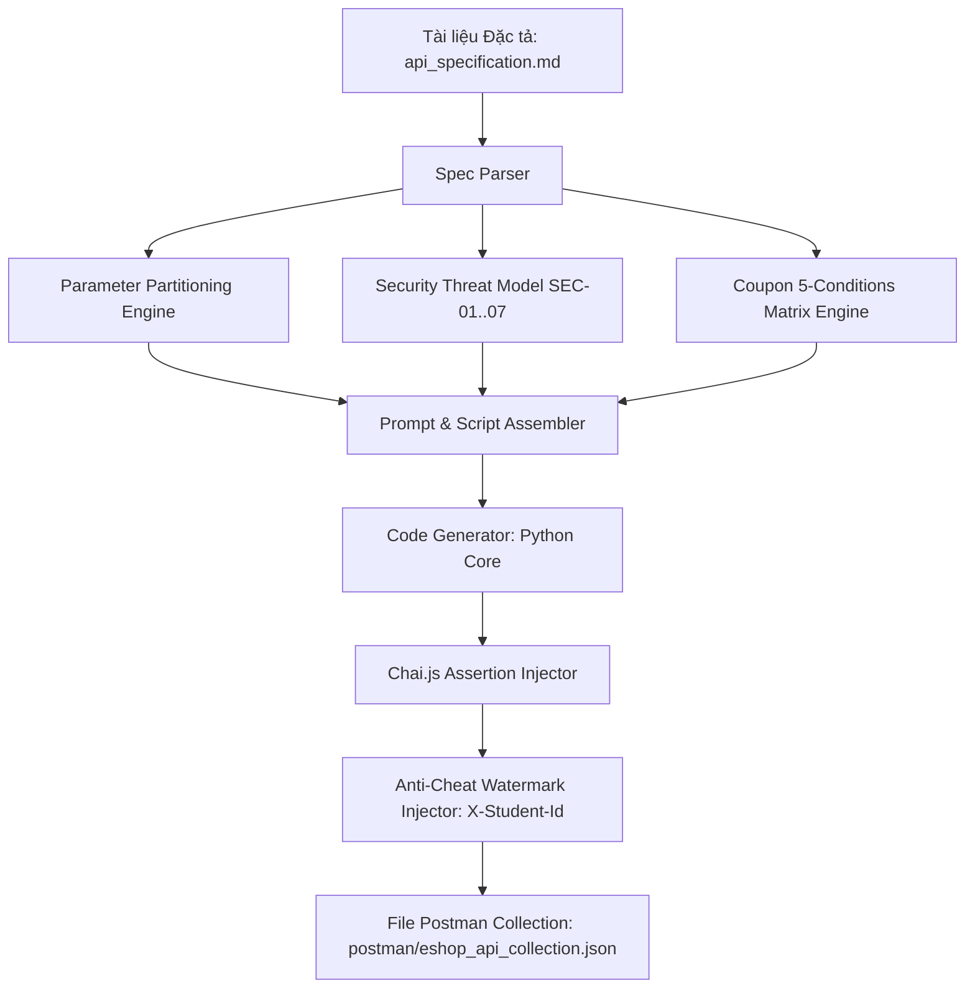

# Thiết kế và Mã giả Thuật toán Agent Skill: AI-Driven API Test Generator

---

## 1. Mục tiêu Thiết kế (Design Objectives)
Hệ thống tự động đọc tài liệu đặc tả API (`api_specification.md`), phân tích các trường tham số và áp dụng 4 kỹ thuật kiểm thử (Domain Partitioning, State Transitions, Security SEC-01..07, Schema Validation) để sinh ra file Postman Collection JSON hoàn chỉnh, có sẵn:
- Headers bắt buộc (bao gồm `X-Student-Id`).
- Payload dữ liệu mẫu tương ứng từng ca kiểm thử.
- Pre-request script và Chai JS Test script.

---

## 2. Sơ đồ Luồng Hoạt động (Mermaid Architecture)



---

## 3. Mã giả Thuật toán (Pseudocode)

```text
ALGORITHM GenerateEShopApiTests(specFile, studentId):
    INPUT: specFile (Markdown API Spec), studentId (MSSV)
    OUTPUT: postmanCollection (JSON v2.1.0)

    collection = InitializeEmptyCollection("HW06_EShop_Tests")
    
    # 1. Xử lý API FR-06 (Product Detail)
    fr06_tests = []
    FOR EACH id_case IN [Valid(1), NonExistent(999999), Zero(0), Negative(-1), SQLi("1 OR 1=1")]:
        tc = BuildGetRequest("/api/products/" + id_case.value)
        tc.expectedStatus = id_case.expectedStatus
        tc.assertions = ["pm.response.to.have.status(" + tc.expectedStatus + ")"]
        fr06_tests.append(tc)
    collection.addFolder("FR-06: Product Detail", fr06_tests)
    
    # 2. Xử lý API FR-09 (Apply Coupon Matrix C1-C5)
    fr09_tests = []
    FOR EACH matrix_row IN LoadCouponMatrix(C1, C2, C3, C4, C5):
        tc = BuildPostRequest("/api/apply-coupon", matrix_row.payload)
        tc.headers.add("Authorization", matrix_row.authHeader)
        tc.expectedStatus = matrix_row.expectedStatus
        IF matrix_row.isSuccess:
            tc.assertions.add("AssertCalculatedDiscount(total, discount, final)")
        fr09_tests.append(tc)
    collection.addFolder("FR-09: Apply Coupon", fr09_tests)
    
    # 3. Xử lý API FR-17 (Admin Coupon CRUD & RBAC)
    fr17_tests = []
    FOR EACH admin_case IN GenerateAdminCrudCases():
        tc = BuildAdminRequest(admin_case.method, admin_case.url, admin_case.payload)
        tc.headers.add("Authorization", admin_case.roleToken)
        tc.expectedStatus = admin_case.expectedStatus
        fr17_tests.append(tc)
    collection.addFolder("FR-17: Admin Coupon CRUD", fr17_tests)
    
    # 4. Gắn Watermark Header chống gian lận cho mọi test item
    FOR EACH item IN collection.getAllItems():
        item.headers.add("X-Student-Id", studentId)
        
    SaveToFile(collection, "postman/eshop_api_collection.json")
    RETURN collection
```
