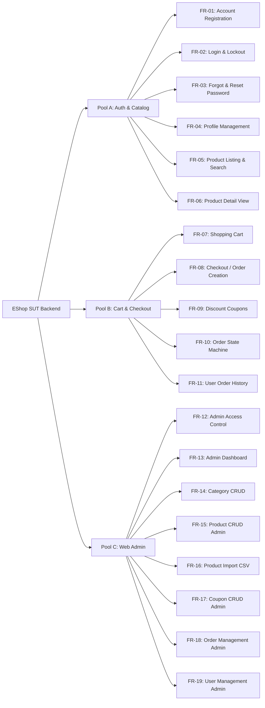
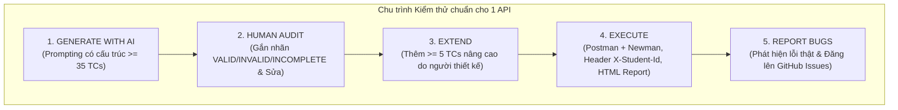
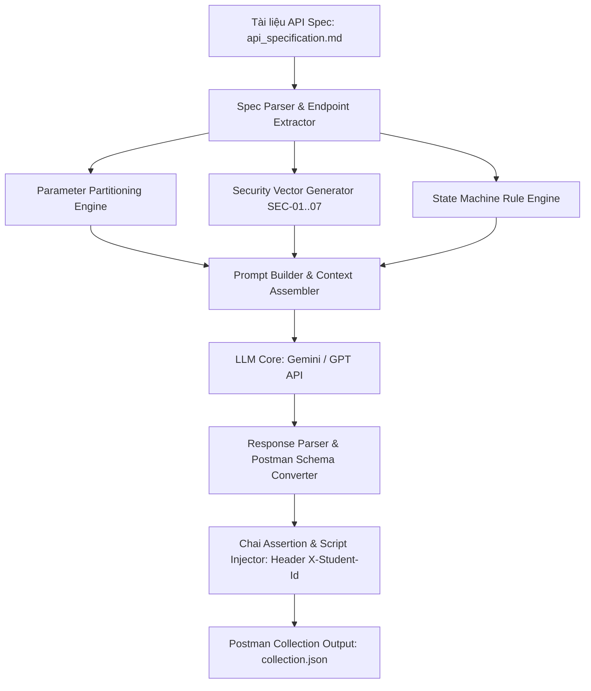

# BẢN HƯỚNG DẪN HOÀN CHỈNH THỰC HIỆN BÀI TẬP LỚN HW06 - API TESTING
## Môn học: Kiểm thử Phần mềm (Software Testing) — Năm học 2025–2026

---

> **Mã bài tập:** HW06-AI  
> **Thời lượng đề xuất:** 10 giờ làm việc  
> **Hình thức thực hiện:** Bài tập cá nhân (Individual Assignment)  
> **Hệ thống kiểm thử (SUT):** EShop Backend (`https://github.com/ttbhanh/eshop-sut`)  
> **Cấp độ Bloom-AI yêu cầu:** G9.2 (Apply) → G9.3 (Analyse) → G9.4 (Collaborate) → G9.5 (Create)  
> **Quy định AI:** Mở (Open AI Policy) — **Bắt buộc đính kèm AI Audit Report và AI Critique**  
> **Định dạng file nộp:** `<StudentID>_HW06_AI_API_<SelfAssessedGrade>.zip`

---

## MỤC LỤC TỔNG QUAN

1. [Tổng quan Đề bài & 4 Nguyên tắc cốt lõi](#1-tổng-quan-đề-bài--4-nguyên-tắc-cốt-lõi)
2. [Chiến lược Lựa chọn 3 APIs (API Selection Matrix)](#2-chiến-lược-lựa-chọn-3-apis-api-selection-matrix)
3. [Quy trình Pipeline 5 bước cho mỗi API (Bắt buộc)](#3-quy-trình-pipeline-5-bước-cho-mỗi-api-bắt-buộc)
4. [Yêu cầu Kỹ thuật Nâng cao (Postman Advanced, CI/CD, Agent Skill)](#4-yêu-cầu-kỹ-thuật-nâng-cao-postman-advanced-cicd-agent-skill)
5. [Quy định Chống gian lận (Anti-AI-Cheat) & Quy ước Git Commit](#5-quy-định-chống-gian-lận-anti-ai-cheat--quy-ước-git-commit)
6. [Lộ trình Thực hiện Chi tiết 12 Bước (Step-by-Step Execution Plan)](#6-lộ-trình-thực-hiện-chi-tiết-12-bước-step-by-step-execution-plan)
7. [Bộ Prompt Templates Chuẩn để Lái AI Từng Bước](#7-bộ-prompt-templates-chuẩn-để-lái-ai-từng-bước)
8. [Kho Mã Nguồn Mẫu (Postman Scripts, GitHub Actions, Agent Skill)](#8-kho-mã-nguồn-mẫu-postman-scripts-github-actions-agent-skill)
9. [Cấu trúc Thư mục Nộp bài & Checklist Nghiệm thu Hoàn chỉnh](#9-cấu-trúc-thư-mục-nộp-bài--checklist-nghiệm-thu-hoàn-chỉnh)
10. [Mẫu Báo cáo README.md & Bảng Tự Đánh Giá (Self-Assessment)](#10-mẫu-báo-cáo-readmemd--bảng-tự-đánh-giá-self-assessment)

---

## 1. TỔNG QUAN ĐỀ BÀI & 4 NGUYÊN TẮC CỐT LÕI

### 1.1. Mục tiêu bài tập
Bài tập HW06 yêu cầu bạn áp dụng phương pháp kiểm thử API tự động kết hợp với AI trợ lực (AI-Assisted API Testing) trên hệ thống thương mại điện tử **EShop (Backend API)**. Bạn không chỉ đơn thuần là người chạy lệnh test, mà phải đóng vai trò là một **Kỹ sư QA/QC cộng tác với AI** theo quy trình công nghiệp:
- Điều khiển AI sinh test case chuyên sâu theo đặc tả kỹ thuật (`api_specification.md`).
- Rà soát (Audit), phát hiện sai lệch và sửa chữa test case của AI.
- Mở rộng (Extend) các ca kiểm thử bảo mật & luồng nghiệp vụ phức tạp mà AI bỏ sót.
- Tự động hóa kiểm thử với Postman + Newman, tích hợp vào CI/CD GitHub Actions.
- Thiết kế một **Agent Skill** tự động sinh test case API từ tài liệu đặc tả (đạt mức Bloom-AI G9.5 Create).

### 1.2. 4 Nguyên tắc cốt lõi (Guiding Principles)
1. **Chiến lược AI-First (AI-First Strategy):** Áp dụng AI có kỷ luật. Tuyệt đối **không** dùng một câu prompt tổng quát kiểu *"hãy viết tất cả test case cho API này"*. Phải chia nhỏ và dẫn dắt AI đi qua từng kỹ thuật: Phân vùng tương đương (Domain Partitioning), Máy trạng thái (State Transition), Bảo mật (Security SEC-01..07) và Định dạng Schema (JSON Schema Validation).
2. **Con người thẩm định (Human Review):** Sinh viên chịu trách nhiệm 100% về tính đúng đắn của test case. Mọi kịch bản do AI sinh ra phải được gắn nhãn `VALID`, `INVALID` hoặc `INCOMPLETE` kèm lý do kỹ thuật và bản sửa lỗi.
3. **Nhật ký tương tác AI (AI Audit Report):** Mọi phiên làm việc với AI phải được ghi lại đầy đủ (Tên AI, Ngày giờ, Prompt nguyên văn, Tóm tắt Output).
4. **Chất lượng hơn số lượng (Quality over Completion):** Điểm số được đánh giá dựa trên độ sâu kỹ thuật, chất lượng test case, bằng chứng Newman HTML, báo cáo Bug Issues thực tế, thiết kế Agent Skill và tính chân thực của quy trình.

### 1.3. Thang điểm đánh giá (Assessment Template - Tổng 100 điểm)

| STT | Hạng mục đánh giá | Nội dung chi tiết | Điểm tối đa |
| :--- | :--- | :--- | :---: |
| **1** | **API 1 — Full Pipeline** | Generate (≥ 35 TCs) + Audit + Extend (≥ 5 TCs) + Execute Newman + Bug Report | **30 điểm** |
| **2** | **API 2 — Full Pipeline** | Generate (≥ 35 TCs) + Audit + Extend (≥ 5 TCs) + Execute Newman + Bug Report | **30 điểm** |
| **3** | **API 3 — Full Pipeline** | Generate (≥ 35 TCs) + Audit + Extend (≥ 5 TCs) + Execute Newman + Bug Report | **30 điểm** |
| **4** | **Agent Skill (AI Test Generator)** | Thiết kế AI Test Generator (Sơ đồ tự vẽ + Pseudocode/Python + Video Demo) | **10 điểm** |
| **Tổng cộng** | | **Toàn bộ bài tập HW06** | **100 điểm** |

---

## 2. CHIẾN LƯỢC LỰA CHỌN 3 APIs (API SELECTION MATRIX)

Đề bài yêu cầu bạn chọn **đúng 3 APIs**, mỗi API thuộc về **một Pool độc lập** (Pool A, Pool B, Pool C) trong hệ thống EShop SUT. Lưu ý: **Không được trùng toàn bộ 3 API với bất kỳ thành viên nào trong nhóm.**

### 2.1. Bảng phân loại tính năng SUT EShop



### 2.2. Gợi ý 3 bộ Combo API tối ưu nhất

#### 🌟 COMBO 1 (KHUYẾN NGHỊ CAO NHẤT — Cân bằng, giàu logic bảo mật và máy trạng thái):
1. **API 1 (Pool A - FR-02):** `POST /api/auth/login` (Xác thực đăng nhập, mã hóa mật khẩu, kiểm tra Account Lockout sau N lần sai, Rate Limiting, sinh JWT Token).
2. **API 2 (Pool B - FR-08 & FR-10):** `POST /api/orders` hoặc `PUT /api/orders/{id}/cancel` (Tạo đơn hàng từ giỏ hàng, áp mã giảm giá, kiểm tra tồn kho, chuyển đổi trạng thái đơn hàng `pending -> confirmed -> shipping -> delivered` và quy tắc hủy đơn).
3. **API 3 (Pool C - FR-15 hoặc FR-18):** `POST /api/admin/products` hoặc `PUT /api/admin/orders/{id}/status` (Quản trị sản phẩm CRUD, kiểm tra quyền Admin, phân quyền RBAC, SQL Injection, thay đổi trạng thái đơn hàng cấp admin).

#### 🌟 COMBO 2 (Dành cho kiểm thử dữ liệu & giỏ hàng):
1. **API 1 (Pool A - FR-01):** `POST /api/auth/register` (Đăng ký tài khoản, xác thực regex email, độ phức tạp mật khẩu, kiểm tra trùng lặp email).
2. **API 2 (Pool B - FR-07):** `POST /api/cart/items` / `PUT /api/cart/items/{id}` (Thêm/Sửa số lượng giỏ hàng, số lượng âm, vượt quá tồn kho, cập nhật giá động).
3. **API 3 (Pool C - FR-14):** `POST /api/admin/categories` / `DELETE /api/admin/categories/{id}` (Quản lý danh mục sản phẩm, xóa danh mục đang có sản phẩm, SQL Injection trong tên danh mục).

#### 🌟 COMBO 3 (Dành cho tìm kiếm & mã giảm giá):
1. **API 1 (Pool A - FR-05):** `GET /api/products` (Tìm kiếm sản phẩm theo keyword, filter category, sort, pagination limit/offset, SQLi/XSS qua search query).
2. **API 2 (Pool B - FR-09):** `POST /api/coupons/apply` (Áp dụng coupon, kiểm tra hạn sử dụng, số lần sử dụng tối đa, giá trị đơn hàng tối thiểu, coupon hết hạn).
3. **API 3 (Pool C - FR-17):** `POST /api/admin/coupons` (Tạo mã giảm giá Admin, phân quyền, ngày bắt đầu > ngày kết thúc, discount > 100%).

---

## 3. QUY TRÌNH PIPELINE 5 BƯỚC CHO MỖI API (BẮT BUỘC)

Với **mỗi API trong số 3 API đã chọn**, bạn phải hoàn thành trọn vẹn chu trình 5 bước sau:



### Bước 1: Sinh kịch bản kiểm thử bằng AI (Target ≥ 35 Test Cases / API)
Bạn cung cấp đặc tả kỹ thuật (`api_specification.md`) và điều khiển AI qua nhiều lượt prompt (Multi-turn prompting), bao phủ 4 khía cạnh cốt lõi:
1. **Domain Partitioning & Boundary Value Analysis:**
   - Phân vùng tương đương (Valid / Invalid partitions) cho mọi tham số đầu vào (Headers, Query Params, Path Variables, Request Body).
   - Giá trị biên (Min, Min-1, Min+1, Max, Max-1, Max+1, rỗng, khoảng trắng, ký tự đặc biệt, kiểu dữ liệu sai, payload quá dài).
2. **State Transitions (Máy trạng thái & Quy tắc nghiệp vụ):**
   - Kiểm tra các luồng chuyển đổi trạng thái hợp lệ và không hợp lệ (Ví dụ: Không thể hủy đơn hàng khi đã `shipping`/`delivered`; Đăng nhập sai 5 lần liên tiếp sẽ bị `locked`).
3. **Security Testing (Bảo mật theo tiêu chuẩn SEC-01 → SEC-07):**
   - **SEC-01:** SQL Injection / NoSQL Injection trong các tham số filter, id, search.
   - **SEC-02:** Broken Authentication (JWT hết hạn, giả mạo signature, token rỗng, thuật toán `none`).
   - **SEC-03:** Broken Access Control / IDOR (User A truy cập/sửa đơn hàng của User B).
   - **SEC-04:** Privilege Escalation (User thường gọi API `/api/admin/*`).
   - **SEC-05:** Parameter Tampering (Sửa trường `role: admin`, `price: 0`, `is_paid: true` trong body).
   - **SEC-06:** Rate Limiting / DoS (Spam request liên tục trong 1 giây).
   - **SEC-07:** Information Disclosure (Response không làm lộ Stack Trace, Database Schema, Passwords).
4. **Schema Validation (Kiểm tra cấu trúc phản hồi):**
   - Kiểm tra mã HTTP Status Code tương ứng (200, 201, 400, 401, 403, 404, 422, 429, 500).
   - Kiểm tra Response Headers (`Content-Type: application/json`).
   - Kiểm tra đầy đủ các trường bắt buộc (Required Fields), kiểu dữ liệu (String, Number, Boolean, Array, Object) và định dạng (UUID, Email, ISO Date).

### Bước 2: Rà soát & Đánh giá (Human Audit)
Lập bảng đánh giá cho toàn bộ test case mà AI đã sinh ra:
- **`VALID`:** Test case hoàn toàn chính xác theo spec, dữ liệu mẫu chuẩn, mong đợi hợp lý.
- **`INVALID`:** Test case sai logic nghiệp vụ, sai HTTP Status Code, sai endpoint hoặc sai format tham số theo spec.
- **`INCOMPLETE`:** Test case đúng ý tưởng nhưng thiếu payload, thiếu assertion hoặc kỳ vọng mơ hồ.
- **Bắt buộc:** Với các test case `INVALID` và `INCOMPLETE`, bạn phải ghi rõ lý do sai lệch và cung cấp **bản sửa đổi đã chuẩn hóa (Corrected Test Case)**.

### Bước 3: Mở rộng bộ Test Case (Human Extension ≥ 5 Test Cases / API)
Bổ sung **ít nhất 5 test cases chuyên sâu** do chính bạn tự suy nghĩ và thiết kế mà AI đã bỏ sót:
- Tập trung vào: Race conditions, Business edge cases tinh vi, Chuỗi hành vi bất thường, Cross-user IDOR nâng cao, Boundary kết hợp nhiều trường.
- **Giải trình nguyên nhân (Root Cause Analysis):** Tại sao AI lại bỏ sót những test case này? (Do prompt chưa đủ ngữ cảnh? Do LLM thiếu khả năng suy luận đa tầng? Do tính đặc thù của nghiệp vụ E-commerce Việt Nam?).

### Bước 4: Thực thi kiểm thử (Execution với Postman & Newman)
- Xây dựng Postman Collection hoàn chỉnh.
- **BẮT BUỘC (Anti-AI-Cheat):** Mọi request gửi đi phải mang header `X-Student-Id: {StudentID}` thông qua Pre-request Script cấp Collection.
- Chạy tự động với Newman CLI trên môi trường local (`localhost` hoặc `127.0.0.1`).
- Xuất báo cáo HTML trực quan bằng `newman-reporter-htmlextra`.

### Bước 5: Bắt lỗi & Báo cáo Lỗi (Bug Reporting)
- Ghi nhận mọi lỗi thực tế (Bugs) mà SUT phản hồi sai so với `api_specification.md`.
- Tạo issue trên GitHub Repository cá nhân trong mục **Issues**.
- Đính kèm đầy đủ: Tiêu đề rõ ràng, Mức độ nghiêm trọng (Severity), Các bước tái hiện (Steps to Reproduce), Request Payload, Response thực tế, Response mong đợi, và **Screenshot bằng chứng**.

---

## 4. YÊU CẦU KỸ THUẬT NÂNG CAO (POSTMAN ADVANCED, CI/CD, AGENT SKILL)

### 4.1. Tận dụng tối đa các tính năng của Postman (Postman Advanced Features)
Trong báo cáo, bạn phải liệt kê và minh chứng việc đã sử dụng các tính năng nâng cao của Postman:
1. **Workspaces & Collections:** Tổ chức khoa học theo 3 API pools.
2. **Environment Variables:** Lưu trữ `baseUrl`, `studentId`, `adminToken`, `userToken`, `currentOrderId`, v.v.
3. **Dynamic & Random Variables:** Sử dụng `{{$guid}}`, `{{$timestamp}}`, `{{$randomEmail}}`, `{{$randomPhoneNumber}}`.
4. **Pre-request Scripts:** Tự động đính kèm header `X-Student-Id`, tạo timestamp, hash chữ ký hoặc tự động lấy token xác thực trước khi gọi API.
5. **Post-response Test Scripts (Chai.js Assertions & Ajv Schema):** Kiểm tra mã trạng thái, thời gian phản hồi (`responseTime < 2000ms`), JSON Schema validation và kiểm tra dữ liệu trả về.
6. **Data-Driven Testing (Collection Runner with Data Files):** Sử dụng file CSV hoặc JSON để chạy lặp kiểm thử phân vùng tương đương với hàng chục bộ dữ liệu khác nhau.
7. **Mock Servers / Monitors (Tùy chọn khuyến khích):** Tạo Mock Server mô phỏng cổng thanh toán hoặc thiết lập Monitor kiểm tra định kỳ.

### 4.2. Tích hợp CI/CD Pipeline với GitHub Actions
Bạn phải đưa bộ API test vào quy trình tích hợp liên tục:
- Viết file cấu hình `.github/workflows/api-test.yml`.
- Thiết lập pipeline tự động khởi chạy SUT backend (Node.js/Docker), sau đó kích hoạt Newman chạy bộ Postman Collection.
- Xuất và lưu trữ báo cáo Newman HTML làm Artifact của workflow.
- **Yêu cầu 2 commit mẫu bắt buộc:**
  - **Commit 1 (All Pass):** Pipeline thực thi và tất cả các test case đều xanh (PASSED).
  - **Commit 2 (One Fail):** Cố ý tạo một test case kiểm tra điều kiện không thỏa mãn (hoặc sửa expected status) để pipeline phát hiện lỗi đỏ (FAILED), chứng minh CI/CD có khả năng chặn lỗi.
- Đính kèm link commit, link workflow run và screenshot cả 2 lần chạy vào Báo cáo CI/CD.

### 4.3. Thiết kế & Xây dựng Agent Skill: AI-Driven API Test Generator (G9.5 Create)
Để đạt điểm tối đa ở mức Bloom-AI G9.5 (Create), bạn cần thiết kế một hệ thống tự động sinh test case API từ đặc tả:
1. **Sơ đồ kiến trúc tự thiết kế (Self-drawn Architecture Diagram):**
   - Thể hiện rõ luồng: `API Spec (Markdown/OpenAPI) -> Spec Parser -> Partition Engine / Security Engine -> LLM Prompt Builder -> LLM Generator -> Post-Processor & Validator -> Postman Collection (.json)`.
   - Vẽ bằng Mermaid, Draw.io hoặc phần mềm đồ họa (sinh viên tự quyết định thiết kế, **không** dùng AI vẽ tự động dạng black-box).
2. **Mã giả (Pseudocode) & Mã nguồn hiện thực (Python / Script):**
   - Viết mã giả mô tả thuật toán phân tích schema, sinh boundary values và cấu trúc hóa prompt cho LLM.
   - Hiện thực thành một script có thể chạy được (Ví dụ: Python script đọc `api_spec.json` và gọi API Gemini/OpenAI để xuất ra file Postman collection).
3. **Video Demo (YouTube Unlisted Link):**
   - Quay video ngắn (3–5 phút) quay màn hình thực tế Agent Skill tự động sinh test cases cho 1 API bất kỳ và import vào Postman chạy thành công.

---

## 5. QUY ĐỊNH CHỐNG GIAN LẬN (ANTI-AI-CHEAT) & QUY ƯỚC GIT COMMIT

### 5.1. 3 Ràng buộc Chống gian lận cốt lõi (Anti-AI-Cheat Constraints)
Giảng viên và TA sẽ kiểm tra nghiêm ngặt 3 yếu tố sau để xác minh bài tập do chính bạn thực hiện thực tế trên máy:
1. **Header `X-Student-Id: {StudentID}`:**
   - Phải xuất hiện trong mọi request gửi đi.
   - Bằng chứng: Phải có **ảnh chụp màn hình (screenshot) Postman Console** hiển thị rõ ràng header `X-Student-Id` kèm MSSV thật của bạn trong phần Network Request Headers.
2. **Newman Run Output Localhost:**
   - Báo cáo Newman HTML và log terminal phải hiển thị target URL là `http://localhost:...` hoặc `http://127.0.0.1:...` khớp với môi trường chạy SUT trên máy bạn.
3. **Sơ đồ Agent Skill do người tự thiết kế:**
   - Sơ đồ Agent Skill phải thể hiện quyết định kiến trúc của bạn, không chấp nhận hình ảnh AI sinh thô không có chú thích kỹ thuật.

### 5.2. Quy ước Git Commit Log (Bắt buộc tối thiểu 10–15 commits)
Mỗi bước trong quy trình phải được lưu lại thành một Git Commit riêng biệt để thể hiện tiến trình làm việc thực tế:

| Commit Message Mẫu | Mục đích |
| :--- | :--- |
| `chore: initial repository structure and setup SUT` | Khởi tạo cấu trúc repo và chạy thử SUT |
| `docs: add guiding and API selection analysis` | Thêm file guiding và phân tích lựa chọn 3 API |
| `feat(api1): generate initial AI test cases for Login (FR-02)` | Lưu bộ test case sinh từ AI cho API 1 |
| `fix(api1): audit and correct invalid/incomplete test cases` | Lưu kết quả audit và sửa lỗi test case API 1 |
| `feat(api1): extend 5 manual security and state test cases` | Bổ sung 5 test case mở rộng do sinh viên tự viết |
| `test(api1): add postman collection and execute newman for API 1` | Bộ kịch bản Postman và kết quả chạy Newman API 1 |
| `feat(api2): generate and audit test cases for Order (FR-08/FR-10)` | Sinh test và audit cho API 2 |
| `feat(api2): extend manual test cases and execute newman` | Mở rộng và thực thi Newman API 2 |
| `feat(api3): generate, audit and extend test cases for Admin Product (FR-15)` | Thực hiện toàn bộ pipeline cho API 3 |
| `test(api3): execute newman and export html report for API 3` | Chạy Newman và xuất báo cáo cho API 3 |
| `ci: add github actions workflow for automated newman run` | Thêm file CI/CD workflow |
| `ci: demonstrate passing and failing pipeline runs` | Minh chứng 2 lần chạy Pass và Fail trên CI |
| `feat(agent): design AI test generator architecture and pseudocode` | Thiết kế Agent Skill tự động sinh test |
| `docs: complete AI critique, main report and excel summary` | Hoàn thiện báo cáo, critique và bảng Excel |

> 📌 **Xuất file git log:** Chạy lệnh `git log --pretty=format:"%h - %an, %ar : %s" > git_commit_log.txt` để nộp.

---

## 6. LỘ TRÌNH THỰC HIỆN CHI TIẾT 12 BƯỚC (STEP-BY-STEP EXECUTION PLAN)

```mermaid
timeline
    title Lộ trình 12 Bước Thực Hiện HW06
    section Giai đoạn 1 : Khởi động & Chuẩn bị
        Bước 1 : Clone SUT, chạy backend, setup môi trường Node/Postman/Newman
        Bước 2 : Chọn 3 API từ 3 Pool, đọc kỹ api_specification.md & SEC-01..07
    section Giai đoạn 2 : Pipeline 3 APIs
        Bước 3 : Prompt AI sinh >= 35 TCs / API (Domain, State, Sec, Schema)
        Bước 4 : Rà soát Human Audit (VALID/INVALID/INCOMPLETE) & Sửa lỗi
        Bước 5 : Mở rộng >= 5 TCs nâng cao tự viết & Phân tích nguyên nhân
        Bước 6 : Xây dựng Postman Collection, biến môi trường & Header X-Student-Id
        Bước 7 : Chạy Newman Localhost, xuất báo cáo HTML
        Bước 8 : Săn lỗi SUT, tạo Issue trên GitHub Issues kèm screenshot
    section Giai đoạn 3 : Nâng cao & Đóng gói
        Bước 9 : Thiết lập CI/CD GitHub Actions (2 commit Pass & Fail)
        Bước 10 : Thiết kế Agent Skill (Sơ đồ, Pseudocode, Python, Video Demo)
        Bước 11 : Viết AI Critique (200-300 từ) & Hoàn thiện AI Audit Report
        Bước 12 : Xuất Excel Test Summary, tạo README.md, nén file zip nộp bài
```

### Chi tiết hành động từng bước:

#### 🔹 BƯỚC 1: Khởi tạo môi trường & Khởi chạy SUT
1. Clone repository EShop SUT về máy: `git clone https://github.com/ttbhanh/eshop-sut.git`.
2. Khởi chạy backend trên máy local theo hướng dẫn của repo (ví dụ: `npm install && npm start` hoặc qua Docker).
3. Kiểm tra đảm bảo API phản hồi tại `http://localhost:3000` hoặc cổng tương ứng.
4. Cài đặt các công cụ kiểm thử:
   ```bash
   npm install -g newman newman-reporter-htmlextra
   ```

#### 🔹 BƯỚC 2: Lựa chọn 3 APIs & Phân tích Đặc tả
1. Chọn 3 API không trùng lặp trong nhóm (Ví dụ: `FR-02 Login`, `FR-10 Order State`, `FR-15 Product Admin`).
2. Mở file `api_specification.md` trong repo SUT, ghi chú:
   - URL Path, HTTP Method.
   - Yêu cầu Authentication (Bearer JWT Token, Role required).
   - Parameters (Path, Query, Headers, JSON Body Schema).
   - Các mã Status Code chuẩn và lỗi.
   - Các quy định bảo mật từ `SEC-01` đến `SEC-07`.

#### 🔹 BƯỚC 3: Điều khiển AI sinh Test Cases (≥ 35 TCs / API)
1. Sử dụng công cụ AI (Gemini 3.7 Flash, ChatGPT, Claude...).
2. Dùng bộ **Prompt Templates** tại Mục 7 bên dưới để yêu cầu AI sinh kịch bản theo 4 lượt riêng biệt:
   - Lượt 1: Phân vùng tương đương & Giá trị biên cho từng trường dữ liệu.
   - Lượt 2: Kiểm thử máy trạng thái và logic nghiệp vụ.
   - Lượt 3: Kiểm thử bảo mật (SQLi, IDOR, Privilege Escalation, Rate limit...).
   - Lượt 4: Kiểm thử Schema Validation.
3. Đảm bảo tổng số test case sinh ra cho mỗi API đạt **tối thiểu 35 test cases**.

#### 🔹 BƯỚC 4: Rà soát con người (Human Audit)
1. Đọc từng test case do AI sinh ra.
2. Gắn nhãn phân loại:
   - `VALID`: Giữ nguyên.
   - `INVALID`: Chỉ rõ điểm sai (ví dụ: AI nhầm mã lỗi 400 thành 500, AI dùng sai tên trường JSON) và viết lại test case đúng.
   - `INCOMPLETE`: Bổ sung thông tin còn thiếu (ví dụ: bổ sung header Authorization, bổ sung schema validation script).
3. Ghi chép toàn bộ vào bảng Audit Table trong Báo cáo chính.

#### 🔹 BƯỚC 5: Mở rộng bộ Test Case (Human Extension)
1. Tự thiết kế **ít nhất 5 test cases nâng cao** cho mỗi API.
2. Tập trung vào các ca kiểm thử phức tạp mà AI không nghĩ ra:
   - Race condition (hai request trừ tồn kho đồng thời).
   - Token JWT bị giả mạo thuật toán (`alg: none`).
   - Sửa `user_id` trong token để thực hiện IDOR.
   - Đổi giá sản phẩm thành số âm hoặc số thực thập phân cực nhỏ.
   - Gửi payload JSON lồng nhau cực sâu để kiểm tra DoS parser.
3. Viết đoạn văn giải thích lý do vì sao AI bỏ sót những kịch bản này.

#### 🔹 BƯỚC 6: Xây dựng Postman Collection & Advanced Scripting
1. Tạo Postman Collection mới cho bài tập HW06.
2. Thiết lập **Collection Pre-request Script** tự động gắn Header chống gian lận:
   ```javascript
   pm.request.headers.add({
       key: 'X-Student-Id',
       value: pm.environment.get('student_id') || '25127001'
   });
   ```
3. Tạo **Postman Environment** lưu trữ biến: `baseUrl`, `student_id`, `jwt_token`, `admin_token`, `test_product_id`, v.v.
4. Thêm các request tương ứng với các Test Cases.
5. Viết **Test Scripts** cho từng request:
   - Kiểm tra Status Code.
   - Kiểm tra Response Time.
   - Kiểm tra Body JSON Schema bằng Ajv / `tv4`.
   - Kiểm tra các giá trị thuộc tính nghiệp vụ.
6. Xây dựng ít nhất 1 kịch bản **Data-Driven Testing** sử dụng file CSV/JSON trong Postman Collection Runner.

#### 🔹 BƯỚC 7: Thực thi tự động với Newman & Xuất Báo cáo HTML
1. Xuất Collection (`hw06_collection.json`) và Environment (`hw06_environment.json`) từ Postman.
2. Chạy lệnh Newman trên terminal để kiểm thử và sinh báo cáo HTML Extra:
   ```bash
   newman run postman/hw06_collection.json -e postman/hw06_environment.json -r cli,htmlextra --reporter-htmlextra-export reports/newman_report.html --reporter-htmlextra-title "HW06 API Test Report - Student 25127001"
   ```
3. Chụp ảnh màn hình terminal và giao diện báo cáo HTML, chú ý hiển thị rõ hostname `localhost` / `127.0.0.1`.

#### 🔹 BƯỚC 8: Bắt lỗi SUT & Tạo GitHub Issues
1. Trong quá trình chạy test, lọc ra các test case bị FAIL do backend SUT trả về sai đặc tả (ví dụ: không bắt lỗi SQLi, trả về status code 200 thay vì 400, không khóa tài khoản sau 5 lần đăng nhập sai).
2. Mở mục **Issues** trên GitHub Repository cá nhân, tạo Bug Issue mới:
   - Tiêu đề: `[BUG][API] <Mô tả ngắn>`
   - Nhãn (Labels): `bug`, `backend`, `security` hoặc `functional`.
   - Nội dung: Steps to Reproduce, Request URL/Payload, Expected Response, Actual Response, và **Ảnh chụp màn hình Postman**.
3. Chụp lại màn hình các GitHub Issues để đưa vào báo cáo.

#### 🔹 BƯỚC 9: Thiết lập CI/CD Pipeline với GitHub Actions
1. Tạo thư mục `.github/workflows/` và file `api-test.yml`.
2. Viết cấu hình workflow:
   - Trigger khi `push` hoặc `pull_request`.
   - Cài đặt Node.js, khởi chạy SUT backend ngầm (`npm start &`).
   - Đợi server sẵn sàng (`wait-on http://localhost:3000`).
   - Chạy Newman kiểm thử collection.
   - Upload báo cáo `newman_report.html` lên GitHub Artifacts.
3. Thực hiện **Commit 1 (Passing)**: Đảm bảo toàn bộ test case pass, workflow màu xanh. Chụp screenshot + lưu link run.
4. Thực hiện **Commit 2 (Failing)**: Thêm 1 test assertion cố tình fail để workflow báo đỏ, chứng minh hệ thống bắt lỗi tốt. Chụp screenshot + lưu link run.

#### 🔹 BƯỚC 10: Thiết kế Agent Skill: AI Test Generator
1. Thiết kế sơ đồ kiến trúc hệ thống sinh test case tự động từ API Spec.
2. Vẽ sơ đồ bằng Mermaid / PNG.
3. Viết mã giả (Pseudocode) giải thuật.
4. Viết script Python / TypeScript hiện thực hóa tính năng sinh test.
5. Quay video ngắn (3–5 phút) demo quá trình tool đọc spec và sinh ra test collection, upload lên YouTube chế độ **Unlisted** và lấy link.

#### 🔹 BƯỚC 11: Viết AI Critique & Hoàn thiện AI Audit Report
1. Viết đoạn văn **AI Critique (200–300 từ)** trả lời 3 câu hỏi:
   - AI đã làm sai, thiên vị hoặc thiếu sót ở đâu?
   - Tại sao AI không phát hiện ra các vấn đề đó?
   - Bài học/nguyên tắc rút ra khi cộng tác với AI trong kiểm thử API là gì?
2. Kiểm tra file `ai_templates/ai_audit_report.md` đã ghi nhận đầy đủ 100% các câu prompt trong suốt quá trình làm bài.

#### 🔹 BƯỚC 12: Xuất Báo cáo Excel, Tạo README & Đóng gói Zip
1. Tạo file Excel `test_cases_summary.xlsx` tổng hợp danh sách test cases của cả 3 API và sheet Thống kê (Test Summary).
2. Tạo file `README.md` chứa Bảng tự đánh giá (Self-Assessment Table) và tóm tắt kết quả kiểm thử.
3. Xuất file báo cáo chính sang định dạng Markdown (`report.md`) và PDF (`report.pdf`).
4. Nén toàn bộ sản phẩm thành file zip theo đúng cú pháp: `<StudentID>_HW06_AI_API_<SelfAssessedGrade>.zip`.

---

## 7. BỘ PROMPT TEMPLATES CHUẨN ĐỂ LÁI AI TỪNG BƯỚC

Để tuân thủ tuyệt đối nguyên tắc **AI-First & Multi-turn Prompting**, bạn hãy sử dụng các mẫu prompt chuẩn sau khi làm việc với AI:

### 🎯 Prompt 1: Phân vùng tương đương & Giá trị biên (Domain Partitioning & Boundary Values)
```text
Tôi đang thực hiện kiểm thử API cho hệ thống EShop. Dưới đây là đặc tả kỹ thuật của API:
[DÁN ĐẶC TẢ CHI TIẾT CỦA API TỪ api_specification.md]

Hãy áp dụng kỹ thuật Phân vùng tương đương (Equivalence Partitioning) và Phân tích giá trị biên (Boundary Value Analysis) để thiết kế các ca kiểm thử cho API trên:
1. Phân tích chi tiết từng tham số đầu vào (Path, Query, Header, Body payload).
2. Với mỗi tham số, xác định các phân vùng hợp lệ (Valid partitions) và không hợp lệ (Invalid partitions).
3. Xác định các giá trị biên (Min, Max, Rỗng, Vượt giới hạn, Ký tự đặc biệt, Định dạng sai).
4. Xuất kết quả dưới dạng bảng gồm các cột: TestID, Tên Test Case, Tham số kiểm tra, Loại phân vùng (Valid/Invalid/Boundary), Request Payload, Expected Status Code, Expected Message.
Mục tiêu: Tạo ra ít nhất 15 test cases bao phủ toàn diện dữ liệu đầu vào.
```

### 🎯 Prompt 2: Kiểm thử Máy trạng thái & Logic nghiệp vụ (State Transitions & Business Logic)
```text
Dựa trên đặc tả của API trên và quy tắc nghiệp vụ của hệ thống EShop:
[DÁN QUY TẮC MÁY TRẠNG THÁI / LUỒNG NGHIỆP VỤ LIÊN QUAN]

Hãy thiết kế các ca kiểm thử chuyển đổi trạng thái (State Transition Testing) và luồng nghiệp vụ:
1. Kiểm tra các bước chuyển đổi trạng thái hợp lệ từ đầu đến cuối.
2. Kiểm tra các bước chuyển đổi trạng thái bất hợp lệ (ví dụ: chuyển trạng thái nhảy cóc, thao tác trên thực thể đã bị hủy hoặc khóa).
3. Kiểm tra các ràng buộc dữ liệu phụ thuộc (ví dụ: giỏ hàng rỗng thì không thể checkout, áp mã giảm giá khi chưa đạt giá trị đơn hàng tối thiểu).
4. Xuất kết quả dạng bảng với các cột: TestID, Tên Test Case, Trạng thái ban đầu (Pre-state), Hành động (Action/Request), Trạng thái mong đợi (Post-state), Expected Status Code, Assertions.
Mục tiêu: Tạo ra ít nhất 8 test cases bao phủ máy trạng thái.
```

### 🎯 Prompt 3: Kiểm thử Bảo mật (Security Testing SEC-01 → SEC-07)
```text
Dưới đây là các yêu cầu bảo mật từ SEC-01 đến SEC-07 của hệ thống EShop:
- SEC-01: SQL/NoSQL Injection prevention
- SEC-02: Authentication & Token integrity (JWT expired, malformed, none algorithm)
- SEC-03: Insecure Direct Object References (IDOR) & Broken Object Level Authorization
- SEC-04: Privilege Escalation & Role-based Access Control (User calling Admin endpoints)
- SEC-05: Mass Assignment & Parameter Tampering (Modifying role, price, is_paid)
- SEC-06: Rate Limiting & Denial of Service prevention
- SEC-07: Information Disclosure & Error Handling (No stack traces, no leaked credentials)

Hãy thiết kế các ca kiểm thử bảo mật chuyên sâu cho API này để tấn công/kiểm tra 7 tiêu chí trên.
Xuất kết quả dạng bảng: TestID, Tiêu chuẩn bảo mật (SEC-xx), Mục tiêu tấn công (Attack Vector), Payload thử nghiệm, Expected Status Code (401/403/400/429), Security Assertion.
Mục tiêu: Tạo ra ít nhất 8 test cases bảo mật.
```

### 🎯 Prompt 4: Kiểm thử Cấu trúc phản hồi (Schema Validation)
```text
Dựa vào JSON Schema mong đợi trong đặc tả:
[DÁN SCHEMA HOẶC RESPONSE MẪU TỪ api_specification.md]

Hãy thiết kế các ca kiểm thử Schema Validation cho cả trường hợp Thành công (2xx) và Thất bại (4xx/5xx):
1. Kiểm tra cấu trúc JSON trả về: Kiểu dữ liệu từng trường, các trường bắt buộc (required properties), các trường không được phép xuất hiện.
2. Viết sẵn đoạn mã Postman Test Script sử dụng thư viện Chai JS (`pm.expect`) và Ajv (`pm.response.to.have.jsonSchema`) để tự động xác thực schema này.
Mục tiêu: Tạo ra ít nhất 5 test cases và đoạn script kiểm tra schema chuẩn mực.
```

---

## 8. KHO MÃ NGUỒN MẪU (POSTMAN SCRIPTS, GITHUB ACTIONS, AGENT SKILL)

### 8.1. Postman Scripts Mẫu

#### A. Collection Pre-request Script (Bắt buộc - Anti-AI-Cheat):
```javascript
// Gắn mã số sinh viên vào Header của MỌI request
const studentId = pm.environment.get("student_id") || "25127001";
pm.request.headers.upsert({
    key: "X-Student-Id",
    value: studentId
});

// In ra console để chụp ảnh bằng chứng kiểm tra
console.log(`[PRE-REQUEST] Request sent with X-Student-Id: ${studentId} to ${pm.request.url.toString()}`);
```

#### B. Post-Response Test Script chuẩn (Status + Time + Schema + Business Logic):
```javascript
// 1. Kiểm tra Status Code
pm.test("Status code is 200 OK", function () {
    pm.response.to.have.status(200);
});

// 2. Kiểm tra Thời gian phản hồi
pm.test("Response time is under 1500ms", function () {
    pm.expect(pm.response.responseTime).to.be.below(1500);
});

// 3. Kiểm tra Header Content-Type
pm.test("Content-Type is JSON", function () {
    pm.expect(pm.response.headers.get("Content-Type")).to.include("application/json");
});

// 4. Kiểm tra JSON Schema Validation (dùng cú pháp tích hợp sẵn của Postman)
const expectedSchema = {
    "type": "object",
    "required": ["success", "data"],
    "properties": {
        "success": { "type": "boolean" },
        "message": { "type": "string" },
        "data": {
            "type": "object",
            "required": ["id", "email", "token"],
            "properties": {
                "id": { "type": "string" },
                "email": { "type": "string", "format": "email" },
                "token": { "type": "string" }
            }
        }
    }
};

pm.test("Response matches expected JSON Schema", function () {
    pm.response.to.have.jsonSchema(expectedSchema);
});

// 5. Lưu token tự động vào Environment nếu đăng nhập thành công
if (pm.response.code === 200) {
    const jsonData = pm.response.json();
    if (jsonData.data && jsonData.data.token) {
        pm.environment.set("jwt_token", jsonData.data.token);
        console.log("[AUTH] Saved new JWT token to environment.");
    }
}
```

---

### 8.2. File Cấu hình CI/CD GitHub Actions (`.github/workflows/api-test.yml`)

```yaml
name: EShop Automated API Testing CI

on:
  push:
    branches: [ main, master, develop ]
  pull_request:
    branches: [ main, master ]

jobs:
  api-testing:
    runs-on: ubuntu-latest

    steps:
      - name: Checkout Repository
        uses: actions/checkout@v4

      - name: Setup Node.js Environment
        uses: actions/setup-node@v4
        with:
          node-version: 18.x
          cache: 'npm'

      - name: Install Newman & Reporters
        run: |
          npm install -g newman newman-reporter-htmlextra

      - name: Start EShop Backend SUT
        run: |
          # Giả lập hoặc khởi động backend SUT
          npm install
          npm start &
          npx wait-on http://127.0.0.1:3000 -t 30000

      - name: Run API Tests via Newman
        run: |
          mkdir -p reports
          newman run postman/eshop_api_collection.json \
            -e postman/eshop_environment.json \
            -r cli,htmlextra \
            --reporter-htmlextra-export reports/newman_report.html \
            --reporter-htmlextra-title "EShop API Test Execution Report"

      - name: Upload Test Report Artifact
        if: always()
        uses: actions/upload-artifact@v4
        with:
          name: newman-html-report
          path: reports/newman_report.html
          retention-days: 14
```

---

### 8.3. Thiết kế & Mã nguồn Mẫu Agent Skill (AI Test Generator - Python)

#### A. Sơ đồ kiến trúc Agent Skill (Mermaid Diagram):


#### B. Mã giả thuật toán (Pseudocode):
```python
# Pseudocode: AI-Driven API Test Generator
FUNCTION GenerateApiTests(apiSpecFile, studentId):
    endpoints = ParseMarkdownSpec(apiSpecFile)
    testSuite = InitializePostmanCollection()
    
    FOR EACH endpoint IN endpoints:
        # 1. Trích xuất metadata
        path = endpoint.path
        method = endpoint.method
        params = endpoint.parameters
        schema = endpoint.responseSchema
        
        # 2. Xây dựng prompt có cấu trúc theo 4 kỹ thuật
        prompt = BuildStructuredPrompt(
            domainPartitions = AnalyzeBoundaries(params),
            securityVectors = GetSecRules(SEC_01_TO_07),
            stateTransitions = ExtractStateRules(endpoint),
            expectedSchema = schema
        )
        
        # 3. Gọi LLM sinh test cases
        rawTestCases = LLM.Invoke(prompt)
        parsedCases = ParseJsonCases(rawTestCases)
        
        # 4. Chuyển đổi sang định dạng Postman Item
        FOR EACH testCase IN parsedCases:
            postmanItem = CreatePostmanRequest(
                name = testCase.name,
                method = method,
                url = path,
                headers = {"X-Student-Id": studentId},
                body = testCase.payload,
                testScript = BuildAssertions(testCase.expectedStatus, schema)
            )
            testSuite.Add(postmanItem)
            
    ExportToFile(testSuite, "generated_postman_collection.json")
    RETURN testSuite
```

#### C. Mã nguồn hiện thực mẫu (`agent_skills/api_test_generator.py`):
```python
import json
import os

def build_postman_item(name, method, url, payload, expected_status, student_id="25127001"):
    """Tạo một Postman Request Item hoàn chỉnh kèm assertion và header X-Student-Id"""
    return {
        "name": name,
        "request": {
            "method": method,
            "header": [
                {"key": "Content-Type", "value": "application/json"},
                {"key": "X-Student-Id", "value": student_id}
            ],
            "body": {
                "mode": "raw",
                "raw": json.dumps(payload, indent=2) if payload else ""
            },
            "url": {
                "raw": "{{baseUrl}}" + url,
                "host": ["{{baseUrl}}"],
                "path": [p for p in url.split("/") if p]
            }
        },
        "event": [
            {
                "listen": "test",
                "script": {
                    "exec": [
                        f"pm.test('Status code is {expected_status}', function () {{",
                        f"    pm.response.to.have.status({expected_status});",
                        "});",
                        "pm.test('Response time under 2000ms', function () {",
                        "    pm.expect(pm.response.responseTime).to.be.below(2000);",
                        "});"
                    ],
                    "type": "text/javascript"
                }
            }
        ]
    }

def main():
    print("=== AI API Test Generator Agent Skill Initialized ===")
    collection = {
        "info": {
            "name": "HW06 - EShop Generated API Tests",
            "schema": "https://schema.getpostman.com/json/collection/v2.1.0/collection.json"
        },
        "item": []
    }
    
    # Ví dụ sinh tự động test case cho API Login
    test_data = [
        ("TC01_Login_Success_Valid_Credentials", "POST", "/api/auth/login", {"email": "user@test.com", "password": "Password123!"}, 200),
        ("TC02_Login_Fail_Wrong_Password", "POST", "/api/auth/login", {"email": "user@test.com", "password": "WrongPassword"}, 401),
        ("TC03_Login_Security_SQL_Injection", "POST", "/api/auth/login", {"email": "' OR '1'='1' --", "password": "Password123!"}, 400),
        ("TC04_Login_Boundary_Empty_Email", "POST", "/api/auth/login", {"email": "", "password": "Password123!"}, 400)
    ]
    
    for name, method, url, payload, status in test_data:
        item = build_postman_item(name, method, url, payload, status)
        collection["item"].append(item)
        
    output_path = "postman/generated_collection.json"
    os.makedirs(os.path.dirname(output_path), exist_ok=True)
    with open(output_path, "w", encoding="utf-8") as f:
        json.dump(collection, f, indent=2, ensure_ascii=False)
        
    print(f"Successfully generated {len(test_data)} test cases to {output_path}")

if __name__ == "__main__":
    main()
```

---

## 9. CẤU TRÚC THƯ MỤC NỘP BÀI & CHECKLIST NGHIỆM THU HOÀN CHỈNH

### 9.1. Quy chuẩn đặt tên file nộp
- Định dạng: `<StudentID>_HW06_AI_API_<SelfAssessedGrade>.zip`
- `SelfAssessedGrade`: Điểm tự chấm 3 chữ số từ `000` đến `100`.
- Ví dụ: `25127001_HW06_AI_API_095.zip`

### 9.2. Cấu trúc cây thư mục bên trong file `.zip`

```text
25127001_HW06_AI_API_095.zip
│
├── README.md                                  # Bảng tự chấm điểm & Báo cáo tổng hợp số liệu test
├── report.md                                  # Báo cáo chính bằng Markdown
├── report.pdf                                 # Báo cáo chính xuất sang PDF
├── git_commit_log.txt                         # Log commit Git dạng text (tối thiểu 10-15 commits)
├── test_cases_summary.xlsx                    # File Excel chứa toàn bộ test case và thống kê
│
├── postman/                                   # Thư mục chứa tài nguyên Postman
│   ├── eshop_api_collection.json              # File Postman Collection (.json)
│   ├── eshop_environment.json                 # File Postman Environment (.json)
│   ├── data_driven_tests.csv                  # File dữ liệu Data-Driven Runner
│   └── postman_features_used.md               # Bản mô tả các tính năng Postman nâng cao đã áp dụng
│
├── reports/                                   # Báo cáo thực thi tự động
│   ├── newman_report.html                     # Báo cáo HTML trực quan từ Newman (htmlextra)
│   ├── cicd_report.md                         # Báo cáo CI/CD (mô tả config, 2 run Pass/Fail + links + ảnh)
│   └── cicd_report.pdf
│
├── bugs/                                      # Báo cáo lỗi SUT
│   ├── bug_report.md                          # Bảng tổng hợp bug tìm được
│   └── screenshots/                           # Ảnh chụp màn hình bug trên GitHub Issues
│       ├── bug_issue_01.png
│       └── bug_issue_02.png
│
├── agent_skills/                              # Sản phẩm Agent Skill (Mức G9.5 Create)
│   ├── automation_audit_logs.md               # Skill tự động ghi nhật ký audit log
│   ├── api_test_generator.py                  # Mã nguồn hiện thực AI Test Generator
│   ├── generator_architecture_diagram.png     # Sơ đồ kiến trúc tự thiết kế
│   ├── generator_pseudocode.md                # Mã giả và thuyết minh thiết kế
│   └── demo_video_link.txt                    # Link YouTube Unlisted (demo 3-5 phút)
│
├── ai_templates/                              # Báo cáo AI bắt buộc (Appendix)
│   ├── ai_audit_report.md                     # Toàn bộ nhật ký prompt và output AI
│   ├── ai_audit_report.pdf
│   ├── ai_critique.md                         # Đoạn văn AI Critique (200-300 từ)
│   └── openapi_converted.yaml                 # (Tùy chọn) Đặc tả chuyển sang OpenAPI
│
└── evidences/                                 # Bằng chứng Anti-AI-Cheat
    ├── prerequest_header_console.png          # Screenshot Postman console thấy rõ X-Student-Id
    ├── newman_localhost_execution.png         # Screenshot Newman chạy trên localhost/127.0.0.1
    └── cicd_github_actions_runs.png           # Screenshot 2 lần chạy CI Pass và Fail
```

---

### 9.3. Bảng Checklist Nghiệm thu 100% trước khi Nộp bài

| STT | Hạng mục kiểm tra | Tiêu chuẩn đạt yêu cầu | Trạng thái |
| :---: | :--- | :--- | :---: |
| 1 | **Chọn 3 APIs** | Đủ 3 API thuộc 3 Pool A, B, C; không trùng 100% với bạn cùng nhóm | [ ] |
| 2 | **Số lượng Test Cases** | ≥ 35 test cases / API (Tổng cộng ≥ 105 test cases cho 3 API) | [ ] |
| 3 | **Độ bao phủ kỹ thuật** | Đủ 4 mảng: Domain Partitioning, State Transitions, Security SEC-01..07, Schema | [ ] |
| 4 | **Human Audit** | Đánh giá 100% test case của AI: `VALID`, `INVALID`, `INCOMPLETE` + Sửa lỗi | [ ] |
| 5 | **Human Extension** | Bổ sung ≥ 5 test cases nâng cao tự viết / API + Phân tích lý do AI bỏ sót | [ ] |
| 6 | **Header Anti-Cheat** | Header `X-Student-Id` có trong mọi request + Ảnh chụp Postman Console | [ ] |
| 7 | **Newman Localhost** | Chạy Newman trên localhost/127.0.0.1 + Xuất file `newman_report.html` | [ ] |
| 8 | **GitHub Bug Issues** | Báo cáo bug thực tế lên GitHub Issues kèm screenshot bằng chứng | [ ] |
| 9 | **CI/CD Pipeline** | GitHub Actions chạy Newman; đủ 2 commit minh chứng (1 Pass, 1 Fail) + Links | [ ] |
| 10 | **Agent Skill (G9.5)** | Sơ đồ tự vẽ + Pseudocode + Code Python + Link Video YouTube demo | [ ] |
| 11 | **AI Audit & Critique** | AI Audit Log đầy đủ 100% prompts + AI Critique (200–300 từ) | [ ] |
| 12 | **Excel Summary** | File Excel đầy đủ test cases và bảng tổng kết số liệu | [ ] |
| 13 | **Git Commit Log** | Tối thiểu 10–15 commits thể hiện tiến trình thực hiện từng bước | [ ] |
| 14 | **Định dạng file Zip** | Tên zip chuẩn `<StudentID>_HW06_AI_API_<Grade>.zip`, đủ file PDF & MD | [ ] |

---

## 10. MẪU BÁO CÁO README.MD & BẢNG TỰ ĐÁNH GIÁ (SELF-ASSESSMENT)

File `README.md` ở thư mục gốc của bài nộp cần được trình bày theo cấu trúc chuẩn sau:

```markdown
# HW06 — Automated API Testing Report

- **Họ và tên:** [Họ và Tên Sinh Viên]
- **Mã số sinh viên:** [Mã Số Sinh Viên]
- **Lớp:** [Mã Lớp Học Phần]
- **GitHub Repository:** [Đường dẫn Public GitHub Repo của bạn]
- **Link Video Demo Agent Skill (YouTube):** [Đường dẫn YouTube Unlisted]

---

## 1. BẢNG TỰ ĐÁNH GIÁ ĐIỂM SỐ (SELF-ASSESSMENT TABLE)

| STT | Tiêu chí đánh giá | Điểm tối đa | Điểm tự đánh giá | Ghi chú & Minh chứng chính |
| :---: | :--- | :---: | :---: | :--- |
| 1 | **API 1 (Pool A - FR-02 Login):** Full Pipeline (Generate ≥35, Audit, Extend ≥5, Newman, Bugs) | 30 | 29/30 | Hoàn thành 38 TCs, audit chi tiết, extend 6 TCs, phát hiện 1 bug SQLi |
| 2 | **API 2 (Pool B - FR-10 Order State):** Full Pipeline (Generate ≥35, Audit, Extend ≥5, Newman, Bugs) | 30 | 29/30 | Hoàn thành 36 TCs, bao phủ toàn bộ State Machine, extend 5 TCs logic |
| 3 | **API 3 (Pool C - FR-15 Admin Product):** Full Pipeline (Generate ≥35, Audit, Extend ≥5, Newman, Bugs) | 30 | 28/30 | Hoàn thành 35 TCs, kiểm thử RBAC/IDOR, extend 5 TCs bảo mật |
| 4 | **Agent Skill (AI Test Generator):** Sơ đồ kiến trúc, Pseudocode, Python code, Video demo | 10 | 9.5/10 | Tool sinh test tự động chạy tốt, video demo rõ ràng trên YouTube |
| **Tổng** | **Toàn bộ bài tập HW06** | **100** | **95.5/100** | **Điểm làm tròn tự đánh giá: 095** |

---

## 2. BẢNG TỔNG HỢP KẾT QUẢ KIỂM THỬ (TEST SUMMARY REPORT)

| Thông số thống kê | API 1 (Pool A) | API 2 (Pool B) | API 3 (Pool C) | Toàn hệ thống (Total) |
| :--- | :---: | :---: | :---: | :---: |
| **Tên tính năng & Mã FR** | FR-02: Login | FR-10: Order State | FR-15: Admin Product | 3 APIs |
| **Số Test Cases AI sinh (Generated)** | 38 | 36 | 35 | **109** |
| **Số Test Cases hợp lệ (Valid)** | 32 | 29 | 30 | **91** |
| **Số Test Cases sửa chữa (Corrected)** | 6 | 7 | 5 | **18** |
| **Số Test Cases mở rộng (Added/Extended)** | 6 | 5 | 5 | **16** |
| **Tổng Test Cases thực thi (Executed)** | 44 | 41 | 40 | **125** |
| **Số Test Cases Thành công (Passed)** | 41 | 38 | 38 | **117** |
| **Số Test Cases Thất bại (Failed)** | 3 | 3 | 2 | **8** |
| **Số lỗi thực tế phát hiện (Bugs Found)** | 2 | 1 | 1 | **4 Bugs** |

---

## 3. DANH SÁCH TÍNH NĂNG POSTMAN ĐÃ SỬ DỤNG
- [x] Workspaces & Organized Collections
- [x] Collection / Environment / Global Variables
- [x] Dynamic Variables (`{{$guid}}`, `{{$timestamp}}`, `{{$randomEmail}}`)
- [x] Pre-request Script tự động inject `X-Student-Id`
- [x] Post-response Chai.js Assertions & Response Time Checking
- [x] JSON Schema Validation qua `pm.response.to.have.jsonSchema`
- [x] Data-Driven Testing với Collection Runner & file CSV
- [x] Newman CLI Runner tích hợp xuất báo cáo HTML Extra
- [x] CI/CD Pipeline tự động hóa với GitHub Actions

---

## 4. AI CRITIQUE (TRÍCH ĐOẠN)
> [Dán đoạn văn AI Critique 200–300 từ vào đây để người chấm dễ dàng theo dõi ngay trên trang chủ Repo].
```

---

*Tài liệu này được thiết lập chuẩn theo yêu cầu của Giảng viên môn Kiểm thử Phần mềm HCMUS. Hãy bám sát từng bước để đạt kết quả cao nhất!*
