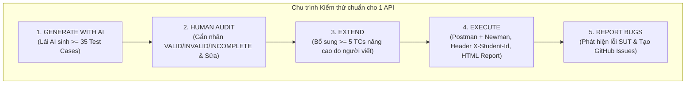
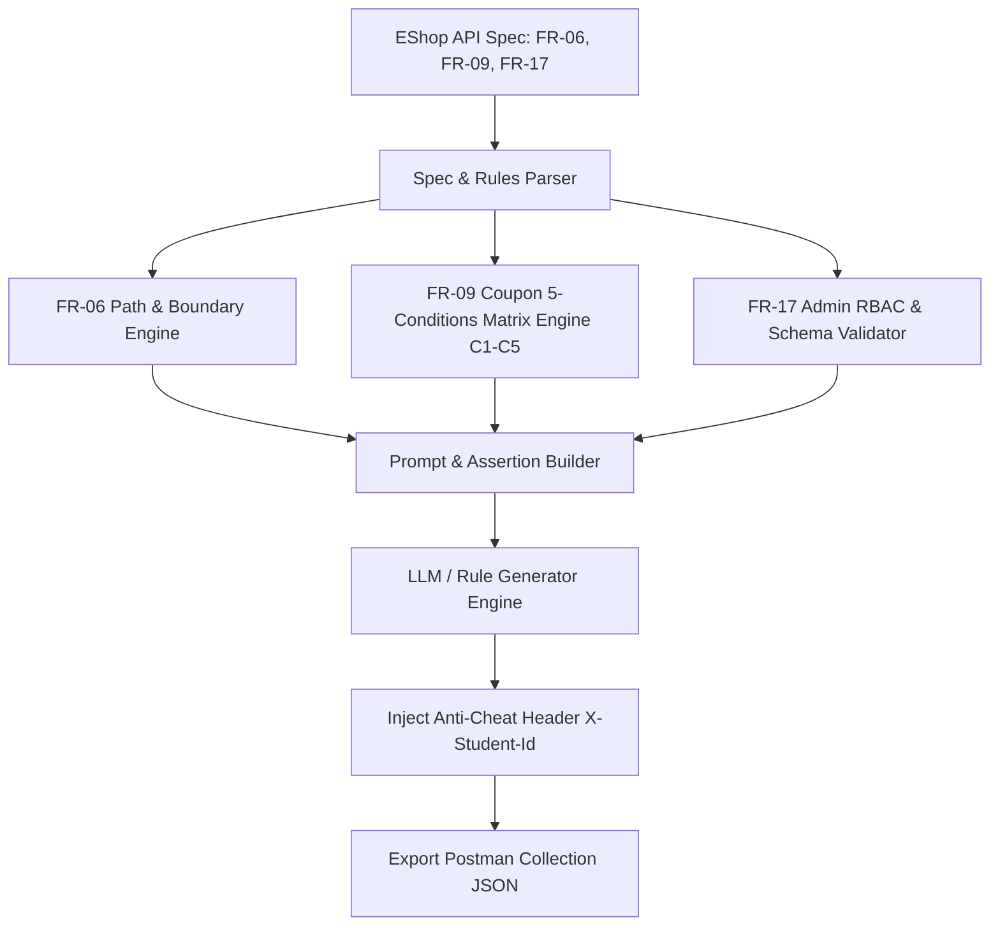

# BẢN HƯỚNG DẪN HOÀN CHỈNH THỰC HIỆN BÀI TẬP LỚN HW06 - API TESTING
## Đề tài: Kiểm thử API Hệ thống EShop (Bộ 3 APIs: FR-06, FR-09, FR-17)
### Môn học: Kiểm thử Phần mềm (Software Testing) — Năm học 2025–2026

---

> **Mã bài tập:** HW06-AI  
> **Thời lượng đề xuất:** 10 giờ làm việc  
> **Hình thức thực hiện:** Bài tập cá nhân (Individual Assignment)  
> **Bộ 3 APIs lựa chọn:**
> - **API 1 (Pool A - FR-06):** Xem chi tiết sản phẩm (`GET /api/products/:id`)
> - **API 2 (Pool B - FR-09):** Áp dụng mã giảm giá (`POST /api/apply-coupon`)
> - **API 3 (Pool C - FR-17):** Quản lý mã giảm giá Admin CRUD (`POST/GET/DELETE /api/admin/coupons`)
>
> **Hệ thống kiểm thử (SUT):** EShop Backend (`Node.js + Express + SQLite` tại `http://localhost:3000`)  
> **Tài khoản mặc định SUT:**
> - **Admin:** `admin@eshop.com` / `Admin123!`
> - **User test:** `test@eshop.com` / `Test1234!`
>
> **Cấp độ Bloom-AI yêu cầu:** G9.2 (Apply) → G9.3 (Analyse) → G9.4 (Collaborate) → G9.5 (Create)  
> **Quy định AI:** Mở (Open AI Policy) — **Bắt buộc đính kèm AI Audit Report và AI Critique**  
> **Định dạng file nộp:** `<StudentID>_HW06_AI_API_<SelfAssessedGrade>.zip`

---

## MỤC LỤC TỔNG QUAN

1. [Tổng quan Đề bài & 4 Nguyên tắc cốt lõi](#1-tổng-quan-đề-bài--4-nguyên-tắc-cốt-lõi)
2. [Đặc tả Kỹ thuật & Nghiệp vụ 3 APIs (FR-06, FR-09, FR-17)](#2-đặc-tả-kỹ-thuật--nghiệp-vụ-3-apis-fr-06-fr-09-fr-17)
3. [Quy trình Pipeline 5 bước cho từng API (Bắt buộc)](#3-quy-trình-pipeline-5-bước-cho-từng-api-bắt-buộc)
4. [Yêu cầu Kỹ thuật Nâng cao (Postman Advanced, CI/CD, Agent Skill)](#4-yêu-cầu-kỹ-thuật-nâng-cao-postman-advanced-cicd-agent-skill)
5. [Quy định Chống gian lận (Anti-AI-Cheat) & Quy ước Git Commit](#5-quy-định-chống-gian-lận-anti-ai-cheat--quy-ước-git-commit)
6. [Lộ trình Thực hiện Chi tiết 12 Bước (Step-by-Step Execution Plan)](#6-lộ-trình-thực-hiện-chi-tiết-12-bước-step-by-step-execution-plan)
7. [Bộ Prompt Templates Chuẩn để Lái AI Từng Bước](#7-bộ-prompt-templates-chuẩn-để-lái-ai-từng-bước)
8. [Kho Mã Nguồn Mẫu (Postman Scripts, GitHub Actions, Agent Skill)](#8-kho-mã-nguồn-mẫu-postman-scripts-github-actions-agent-skill)
9. [Cấu trúc Thư mục Nộp bài & Checklist Nghiệm thu Hoàn chỉnh](#9-cấu-trúc-thư-mục-nộp-bài--checklist-nghiệm-thu-hoàn-chỉnh)
10. [Mẫu Báo cáo README.md & Bảng Tự Đánh Giá (Self-Assessment)](#10-mẫu-báo-cáo-readmemd--bảng-tự-đánh-giá-self-assessment)

---

## 1. TỔNG QUAN ĐỀ BÀI & 4 NGUYÊN TẮC CỐT LÕI

### 1.1. Mục tiêu bài tập
Bài tập HW06 yêu cầu bạn đóng vai trò là một **Kỹ sư QA/QC cộng tác với AI** để kiểm thử tự động toàn diện 3 Backend API thuộc 3 nhóm tính năng khác nhau của EShop:
- **API 1 (Pool A - FR-06):** Xem chi tiết sản phẩm — Kiểm thử tham số Path, lỗi tìm kiếm, SQLi, Schema sản phẩm.
- **API 2 (Pool B - FR-09):** Áp dụng mã giảm giá — Kiểm thử logic nghiệp vụ 5 điều kiện (C1–C5), công thức tính toán `percent` / `fixed`, kiểm soát hạn mức và bảo mật Authentication/IDOR.
- **API 3 (Pool C - FR-17):** Quản lý mã giảm giá Admin — Kiểm thử phân quyền RBAC (SEC-04), toàn vẹn dữ liệu CRUD, ràng buộc ngày hết hạn, tỷ lệ giảm giá và chống SQLi.

### 1.2. 4 Nguyên tắc cốt lõi (Guiding Principles)
1. **Chiến lược AI-First (AI-First Strategy):** Điều khiển AI từng bước (Multi-turn Prompting), không dùng 1 prompt chung chung. Chia nhỏ theo 4 kỹ thuật: Phân vùng tương đương & Biên (Domain Partitioning & Boundary Values), Máy trạng thái (State Transition), Bảo mật (Security SEC-01..07) và Định dạng Schema (JSON Schema Validation).
2. **Con người thẩm định (Human Review):** Rà soát toàn bộ test cases do AI sinh ra, phân loại `VALID`, `INVALID`, `INCOMPLETE` và giải trình nguyên nhân kèm bản sửa lỗi chuẩn.
3. **Nhật ký tương tác AI (AI Audit Report):** Tự động ghi chép lại toàn bộ các câu prompt và tóm tắt phản hồi vào file `ai_templates/ai_audit_report.md`.
4. **Bằng chứng thực thi thật (Anti-AI-Cheat):** Gắn header `X-Student-Id: {StudentID}` trong mọi request, thực thi Newman trên `localhost:3000`, nộp log commit Git đầy đủ.

### 1.3. Thang điểm đánh giá (Thang 100 điểm)

| STT | Hạng mục đánh giá | Yêu cầu chi tiết | Điểm |
| :---: | :--- | :--- | :---: |
| **1** | **API 1 — FR-06 (Pool A)** | Generate (≥35 TCs) + Audit + Extend (≥5 TCs) + Execute Newman + Bug Report | **30 điểm** |
| **2** | **API 2 — FR-09 (Pool B)** | Generate (≥35 TCs) + Audit + Extend (≥5 TCs) + Execute Newman + Bug Report | **30 điểm** |
| **3** | **API 3 — FR-17 (Pool C)** | Generate (≥35 TCs) + Audit + Extend (≥5 TCs) + Execute Newman + Bug Report | **30 điểm** |
| **4** | **Agent Skill (AI Test Generator)** | Thiết kế hệ thống sinh test case tự động (Sơ đồ + Pseudocode + Python + Demo Video) | **10 điểm** |
| **Tổng** | | **Toàn bộ bài tập HW06** | **100 điểm** |

---

## 2. ĐẶC TẢ KỸ THUẬT & NGHIỆP VỤ 3 APIS (FR-06, FR-09, FR-17)

### 2.1. API 1 (Pool A) — FR-06: Xem chi tiết sản phẩm (Product Detail View)
- **Endpoint:** `GET /api/products/:id`
- **Method:** `GET`
- **Authentication:** Public (Không yêu cầu Token).
- **Tham số:** Path parameter `:id` (ID của sản phẩm trong CSDL SQLite).
- **Yêu cầu giao diện/nghiệp vụ liên quan:**
  - Hiển thị đầy đủ thông tin: Ảnh lớn (`imageUrl`), Tên (`name`), Giá (`price`), Mô tả (`description`), Danh mục (`category_id` / danh mục liên kết).
  - Có ô nhập số lượng (chỉ nhận số nguyên dương, tối thiểu là 1).
- **Phản hồi mong đợi:**
  - **200 OK:** Khi `id` hợp lệ và tồn tại trong hệ thống.
    ```json
    {
      "id": 1,
      "name": "Áo thun Nam EShop",
      "price": 150000,
      "description": "Chất liệu cotton thoáng mát",
      "imageUrl": "http://localhost:3000/images/p1.jpg",
      "category_id": 1
    }
    ```
  - **404 Not Found:** Khi `id` là số nguyên dương nhưng không tồn tại trong CSDL (ví dụ `id = 999999`).
  - **400 Bad Request:** Khi `id` không phải định dạng hợp lệ (chuỗi chữ, số âm, số thực, ký tự đặc biệt) hoặc chứa payload tấn công SQL Injection (`1' OR '1'='1`).

---

### 2.2. API 2 (Pool B) — FR-09: Áp dụng mã giảm giá (Apply Discount Coupon)
- **Endpoint:** `POST /api/apply-coupon`
- **Method:** `POST`
- **Headers:**
  - `Content-Type: application/json`
  - `Authorization: Bearer <user_jwt_token>` *(Bắt buộc đăng nhập - Điều kiện C4)*
  - `X-Student-Id: {StudentID}` *(Header chống gian lận)*
- **Request Body:**
  ```json
  {
    "code": "SAVE10",
    "total_amount": 500000,
    "user_id": 1
  }
  ```
- **5 Điều kiện Nghiệp vụ cốt lõi (C1 → C5) — TẤT CẢ PHẢI THỎA MÃN:**

| Điều kiện | Tên điều kiện | Quy tắc nghiệp vụ | Mã phản hồi mong đợi khi vi phạm |
| :---: | :--- | :--- | :---: |
| **C1** | **Mã tồn tại & Kích hoạt** | Mã có trong CSDL và `is_active = 1`. Nếu mã không tồn tại hoặc `is_active = 0` -> Báo lỗi. | `400 Bad Request` / `404 Not Found` |
| **C2** | **Còn hạn sử dụng** | Ngày hiện tại $\le$ `expired_at`. Nếu ngày hiện tại > `expired_at` (như mã `EXPIRED`) -> Báo lỗi hết hạn. | `400 Bad Request` |
| **C3** | **Đủ ngưỡng đơn hàng** | `total_amount` $\ge$ `min_order_amount`. Nếu chưa đạt ngưỡng tối thiểu -> Báo lỗi chưa đủ điều kiện. | `400 Bad Request` |
| **C4** | **Đã đăng nhập** | Header có Bearer Token hợp lệ của user. Nếu không có token hoặc token sai/hết hạn -> Báo lỗi xác thực. | `401 Unauthorized` |
| **C5** | **Chưa dùng hết lượt** | Số lần user đã dùng mã `< max_uses_per_user`. Nếu đã đạt giới hạn sử dụng -> Báo lỗi hết lượt dùng. | `400 Bad Request` |

- **Công thức tính giảm giá:**
  - **Loại `percent`:**
    $$\text{discount\_amount} = \frac{\text{total\_amount} \times \text{discount\_value}}{100}$$
    $$\text{final\_amount} = \text{total\_amount} - \text{discount\_amount}$$
  - **Loại `fixed`:**
    $$\text{discount\_amount} = \text{discount\_value}$$
    $$\text{final\_amount} = \max(0, \text{total\_amount} - \text{discount\_amount})$$
- **Dữ liệu mã giảm giá mẫu trong CSDL EShop:**

| Mã Coupon | Loại (Type) | Giá trị (Value) | Ngưỡng tối thiểu (Min Order) | Hạn dùng (Expired At) | Số lần/người (Max Uses) |
| :--- | :---: | :---: | :---: | :---: | :---: |
| `SAVE10` | `percent` | 10% | 300,000 ₫ | 2099-12-31 | 1 |
| `BIGBUY` | `fixed` | 50,000 ₫ | 500,000 ₫ | 2099-12-31 | 1 |
| `VIP100` | `fixed` | 100,000 ₫ | 300,000 ₫ | 2099-12-31 | 2 |
| `EXPIRED` | `percent` | 20% | 100,000 ₫ | 2020-01-01 | 1 |

- **Phản hồi thành công (200 OK):**
  ```json
  {
    "success": true,
    "message": "Coupon applied successfully",
    "coupon": {
      "code": "SAVE10",
      "type": "percent",
      "discount_value": 10
    },
    "original_amount": 500000,
    "discount_amount": 50000,
    "final_amount": 450000
  }
  ```

---

### 2.3. API 3 (Pool C) — FR-17: Quản lý Mã Giảm Giá CRUD Admin (Admin Coupon CRUD)
- **Tập hợp Endpoints:**
  1. **Thêm mã mới:** `POST /api/admin/coupons`
  2. **Lấy danh sách mã:** `GET /api/coupons` hoặc `GET /api/admin/coupons`
  3. **Xóa mã giảm giá:** `DELETE /api/admin/coupons/:id`
- **Headers:**
  - `Authorization: Bearer <admin_token>` *(Bắt buộc tài khoản Admin: `admin@eshop.com`)*
  - `Content-Type: application/json`
  - `X-Student-Id: {StudentID}`
- **Request Body khi tạo mã mới (`POST /api/admin/coupons`):**
  ```json
  {
    "code": "SUMMER2026",
    "type": "percent",
    "discount_value": 15,
    "min_order_amount": 250000,
    "expired_at": "2026-12-31",
    "max_uses_per_user": 1
  }
  ```
- **Ràng buộc trường dữ liệu bắt buộc:**
  - `code`: Chuỗi không rỗng, duy nhất trong hệ thống (Unique constraint). Trùng code -> `400 Bad Request`.
  - `type`: Chỉ chấp nhận `"percent"` hoặc `"fixed"`. Truyền giá trị khác -> `400 Bad Request`.
  - `discount_value`: Số dương (> 0). Nếu `type = "percent"`, giá trị phải trong khoảng $(0, 100]$.
  - `expired_at`: Chuỗi ngày hợp lệ định dạng `YYYY-MM-DD`.
  - `min_order_amount`: Số không âm ($\ge 0$).
  - `max_uses_per_user`: Số nguyên dương ($\ge 1$).
- **Quy tắc phân quyền & Bảo mật (SEC-01..07):**
  - Không truyền Token -> `401 Unauthorized`.
  - Truyền Token của User thường (`test@eshop.com`) -> `403 Forbidden` (Chống leo thang đặc quyền SEC-04).
  - Tấn công SQL Injection trong `code` hoặc `id` xóa -> Bắt lỗi an toàn, không làm sập SQLite hay trả về 500 Stack Trace (SEC-01, SEC-07).

---

## 3. QUY TRÌNH PIPELINE 5 BƯỚC CHO TỪNG API (BẮT BUỘC)

Với mỗi API trong bộ 3 (`FR-06`, `FR-09`, `FR-17`), thực hiện nghiêm ngặt 5 bước:



### Bước 1: Lái AI sinh kịch bản kiểm thử (Mục tiêu $\ge 35$ Test Cases / API)
Chia thành 4 lượt Prompt có cấu trúc rõ ràng:
1. **Domain Partitioning & Boundary Values:** Phân tích từng trường (Path `:id`, Body `code`, `total_amount`, `discount_value`, `type`, `expired_at`).
2. **State Transitions & Business Logic:**
   - Với FR-06: Sản phẩm tồn tại $\rightarrow$ Sản phẩm bị xóa/ẩn.
   - Với FR-09: Mã mới $\rightarrow$ Áp dụng lần 1 (Pass) $\rightarrow$ Áp dụng lần 2 vượt `max_uses` (Fail) $\rightarrow$ Mã hết hạn (Fail).
   - Với FR-17: Tạo mã $\rightarrow$ Xem mã $\rightarrow$ Áp dụng thử $\rightarrow$ Xóa mã $\rightarrow$ Áp dụng lại (Fail 404).
3. **Security Testing (SEC-01 → SEC-07):** SQLi trên tham số tìm kiếm/code, Token giả mạo, IDOR thay đổi `user_id` khi áp coupon, User thường gọi API Admin coupon, Rate Limiting spam request coupon.
4. **Schema Validation:** Kiểm tra kiểu dữ liệu JSON, status code, các trường bắt buộc (`success`, `discount_amount`, `final_amount`).

### Bước 2: Rà soát & Đánh giá (Human Audit)
Lập bảng đánh giá cho toàn bộ test case của AI:
- `VALID`: Đúng hoàn toàn theo spec.
- `INVALID`: Sai status code mong đợi, sai tên trường body, sai logic tính toán.
- `INCOMPLETE`: Thiếu header Authorization, thiếu schema assertion, thiếu payload mẫu.
- **Bắt buộc:** Đưa ra bảng sửa đổi chi tiết cho các ca kiểm thử không đạt.

### Bước 3: Mở rộng bộ Test Case (Human Extension $\ge 5$ Test Cases / API)
Tự viết ít nhất 5 test case nâng cao mà AI thường bỏ sót:
- **FR-06:** Gửi ID cực lớn vượt ngưỡng Integer (`999999999999999999999`), kiểm tra Injection dạng boolean-based SQLite, kiểm tra tính đồng thời khi sản phẩm bị xóa giữa lúc xem chi tiết.
- **FR-09:** Race Condition khi 2 request áp coupon đồng thời từ cùng 1 user, Total amount có phần thập phân (`500000.55`), `discount_value` dạng fixed lớn hơn `total_amount` (kiểm tra `final_amount` có bị âm không), Giả mạo `user_id` trong body khác với `user_id` trong JWT Token (IDOR SEC-03).
- **FR-17:** Tạo coupon với `discount_value = 0` hoặc `101%`, ngày hết hạn là ngày 29/02 năm nhuận, tạo 2 coupon cùng code đồng thời (Race condition unique check), Xóa coupon đã có người sử dụng.
- **Giải trình:** Phân tích vì sao AI bỏ sót các trường hợp này (do AI chỉ suy luận đơn tuyến, không tự liên hệ với rủi ro tài chính hoặc lỗi kiến trúc SQLite).

### Bước 4: Thực thi tự động với Postman & Newman
- Đưa toàn bộ test cases (gồm AI và Extension) vào Postman Collection.
- Gắn header `X-Student-Id: {StudentID}` qua Pre-request Script.
- Thực thi Newman CLI trên `localhost:3000` và xuất báo cáo HTML Extra.

### Bước 5: Bắt lỗi SUT & Tạo GitHub Issues
- Tìm kiếm các lỗi thực tế của SUT EShop (Ví dụ: API `/api/apply-coupon` không kiểm tra `user_id` khớp với Token, hoặc cho phép `discount_value > 100%` khi tạo mã Admin).
- Đăng Issue lên GitHub Repository kèm ảnh chụp màn hình Postman làm bằng chứng.

---

## 4. YÊU CẦU KỸ THUẬT NÂNG CAO (POSTMAN ADVANCED, CI/CD, AGENT SKILL)

### 4.1. Tận dụng tối đa tính năng Postman
1. **Variables & Environments:** Khai báo `baseUrl: http://localhost:3000`, `student_id: 25127001`, `user_token`, `admin_token`, `test_product_id`, `created_coupon_id`.
2. **Dynamic Variables:** Sử dụng `{{$randomAlphaNumeric}}` để tạo code coupon ngẫu nhiên không bao giờ bị trùng.
3. **Pre-request Script Tự động:** Tự động đăng nhập lấy Token Admin và User lưu vào biến môi trường trước khi chạy test suites.
4. **Data-Driven Testing:** Sử dụng file `data_driven_coupons.csv` chứa 10 bộ dữ liệu khác nhau (thỏa và không thỏa C1–C5) để chạy lặp qua Collection Runner.
5. **JSON Schema Validator (Ajv):** Xác thực cấu trúc response bằng `pm.response.to.have.jsonSchema(schema)`.

### 4.2. Tích hợp CI/CD Pipeline với GitHub Actions
- Tạo workflow `.github/workflows/api-test.yml`.
- Quy trình tự động: Checkout code $\rightarrow$ Cài Node.js $\rightarrow$ Khởi chạy backend SUT ngầm $\rightarrow$ Chạy Newman $\rightarrow$ Upload artifact `newman_report.html`.
- **2 Commit minh chứng:**
  - **Commit 1 (All Pass):** Toàn bộ test case chạy thành công, pipeline màu xanh.
  - **Commit 2 (One Fail):** Cố tình thêm 1 assertion sai (ví dụ mong đợi status code 201 thay vì 200) để pipeline phát hiện lỗi đỏ.

### 4.3. Thiết kế & Xây dựng Agent Skill (AI Test Generator - G9.5 Create)
- Xây dựng công cụ bằng Python (`agent_skills/api_test_generator.py`) có khả năng đọc đặc tả của FR-06, FR-09, FR-17 và tự động sinh ra file `postman_collection.json`.
- Vẽ sơ đồ kiến trúc tự thiết kế (Mermaid/PNG) thể hiện rõ cơ chế phân tích schema, sinh boundary values và inject Chai assertions.
- Quay video demo 3–5 phút upload lên YouTube chế độ Unlisted.

---

## 5. QUY ĐỊNH CHỐNG GIAN LẬN (ANTI-AI-CHEAT) & QUY ƯỚC GIT COMMIT

### 5.1. 3 Bằng chứng Chống gian lận bắt buộc
1. **Header `X-Student-Id: {StudentID}`:** Chụp ảnh màn hình Postman Console hiển thị rõ header này trong Network Request Headers.
2. **Newman Output Localhost:** Báo cáo HTML và log terminal phải hiển thị target URL là `http://localhost:3000` hoặc `http://127.0.0.1:3000`.
3. **Sơ đồ Agent Skill:** Tự vẽ và giải thích chi tiết quyết định thiết kế.

### 5.2. Lịch sử Git Commit Log (Tối thiểu 12–15 commits)
Mỗi thao tác phải được commit rõ ràng:
- `chore: initial repo and verify SUT backend at localhost:3000`
- `docs: add guiding for FR-06, FR-09, FR-17`
- `feat(fr06): prompt AI to generate 35+ test cases for Product Detail`
- `fix(fr06): audit and correct invalid test cases for FR-06`
- `feat(fr06): extend 5 manual security and boundary test cases`
- `test(fr06): execute newman and export report for FR-06`
- `feat(fr09): generate, audit and extend test cases for Coupon Apply (FR-09)`
- `test(fr09): execute postman data-driven testing for coupon conditions C1-C5`
- `feat(fr17): generate, audit and extend test cases for Admin Coupon CRUD (FR-17)`
- `test(fr17): execute newman and verify RBAC security tests`
- `ci: add github actions workflow for automated newman execution`
- `ci: demonstrate passing and failing pipeline runs`
- `feat(agent): design AI-driven test generator architecture and python script`
- `docs: write AI critique, summarize excel test suite and prepare zip`

---

## 6. LỘ TRÌNH THỰC HIỆN CHI TIẾT 12 BƯỚC (STEP-BY-STEP ACTION PLAN)

```mermaid
timeline
    title Lộ trình 12 Bước Thực Hiện HW06 (FR-06, FR-09, FR-17)
    section Giai đoạn 1 : Chuẩn bị
        Bước 1 : Clone SUT, chạy backend Node.js tại localhost:3000, kiểm tra tài khoản test
        Bước 2 : Đọc kỹ spec FR-06, FR-09 (5 điều kiện C1-C5) và FR-17 (Admin CRUD)
    section Giai đoạn 2 : Pipeline 3 APIs
        Bước 3 : Prompt AI sinh >= 35 TCs / API (Domain, State, Security, Schema)
        Bước 4 : Rà soát Audit (VALID/INVALID/INCOMPLETE) & Sửa lỗi kỹ thuật
        Bước 5 : Tự viết >= 5 TCs nâng cao / API (Race condition, IDOR, Boundary)
        Bước 6 : Xây dựng Postman Collection, biến môi trường & Header X-Student-Id
        Bước 7 : Chạy Newman CLI trên localhost:3000, xuất báo cáo HTML Extra
        Bước 8 : Săn lỗi SUT, tạo Issue trên GitHub Issues kèm ảnh chụp Postman
    section Giai đoạn 3 : Nâng cao & Đóng gói
        Bước 9 : Thiết lập CI/CD GitHub Actions (2 commit minh chứng Pass & Fail)
        Bước 10 : Thiết kế Agent Skill (Sơ đồ, Pseudocode, Python, Video Demo)
        Bước 11 : Viết AI Critique (200-300 từ) & Kiểm tra AI Audit Report
        Bước 12 : Xuất Excel Test Cases, cập nhật README.md, nén file zip nộp bài
```

### Hướng dẫn thao tác từng bước:

#### 🔹 BƯỚC 1: Khởi động Backend SUT EShop
1. Mở terminal tại thư mục mã nguồn SUT.
2. Cài đặt và khởi chạy backend:
   ```bash
   npm install
   npm start
   ```
3. Kiểm tra API hoạt động tại `http://localhost:3000`.
4. Đăng nhập thử 2 tài khoản để lấy token:
   - Admin: `admin@eshop.com` / `Admin123!`
   - User: `test@eshop.com` / `Test1234!`

#### 🔹 BƯỚC 2: Rà soát Đặc tả & Dữ liệu Seed
1. Kiểm tra CSDL SQLite xem đã có sẵn các sản phẩm (cho FR-06) và các mã coupon mẫu (`SAVE10`, `BIGBUY`, `VIP100`, `EXPIRED` cho FR-09) chưa.
2. Xác định rõ endpoint và phương thức HTTP:
   - FR-06: `GET /api/products/:id`
   - FR-09: `POST /api/apply-coupon`
   - FR-17: `POST /api/admin/coupons`, `GET /api/coupons`, `DELETE /api/admin/coupons/:id`

#### 🔹 BƯỚC 3: Prompt AI sinh Test Cases (≥ 35 TCs / API)
Sử dụng các mẫu prompt tại [Mục 7](#7-bộ-prompt-templates-chuẩn-để-lái-ai-từng-bước) để yêu cầu AI sinh kịch bản cho từng API. Đảm bảo tổng số test case sinh ra cho mỗi API $\ge 35$.

#### 🔹 BƯỚC 4: Rà soát & Đánh giá (Human Audit)
Lập bảng đánh giá từng ca kiểm thử. Chú ý các lỗi AI thường mắc phải:
- AI quên yêu cầu Bearer Token khi gọi API `/api/apply-coupon`.
- AI nhầm lẫn công thức tính giảm giá `percent` và `fixed`.
- AI tưởng `type` của coupon nhận giá trị bất kỳ thay vì enum `["percent", "fixed"]`.
- AI không chỉ rõ status code `401` vs `403` khi kiểm tra quyền Admin ở FR-17.

#### 🔹 BƯỚC 5: Mở rộng bộ Test Case (Human Extension)
Tự thiết kế ít nhất 5 test cases mở rộng cho mỗi API (Tổng $\ge 15$ test cases tự viết):
- Viết giải trình nguyên nhân vì sao AI bỏ sót các kịch bản này.

#### 🔹 BƯỚC 6: Xây dựng Postman Collection & Scripting
1. Tạo Collection `HW06_EShop_API_Testing`.
2. Tạo các Folders: `01_Auth_Helpers`, `02_FR06_Product_Detail`, `03_FR09_Apply_Coupon`, `04_FR17_Admin_Coupon_CRUD`.
3. Gắn Pre-request Script tự động gán `X-Student-Id`.
4. Viết Test Script kiểm tra Status, Time (< 1500ms), JSON Schema, và dữ liệu nghiệp vụ.
5. Tạo file `data_driven_coupons.csv` để chạy kiểm thử Data-driven cho FR-09.

#### 🔹 BƯỚC 7: Chạy Newman & Xuất Báo cáo HTML
1. Xuất file `postman/eshop_api_collection.json` và `postman/eshop_environment.json`.
2. Cài đặt Newman và reporter:
   ```bash
   npm install -g newman newman-reporter-htmlextra
   ```
3. Chạy lệnh:
   ```bash
   newman run postman/eshop_api_collection.json -e postman/eshop_environment.json -r cli,htmlextra --reporter-htmlextra-export reports/newman_report.html --reporter-htmlextra-title "HW06 API Test Report - Student {StudentID}"
   ```

#### 🔹 BƯỚC 8: Báo cáo Lỗi SUT trên GitHub Issues
1. Tổng hợp các lỗi phát hiện được trong quá trình chạy test trên SUT.
2. Tạo Issue trên GitHub Repository cá nhân với format chuẩn và đính kèm ảnh chụp Postman.

#### 🔹 BƯỚC 9: Thiết lập CI/CD GitHub Actions
1. Tạo file `.github/workflows/api-test.yml`.
2. Đẩy code lên GitHub để kích hoạt pipeline Pass (Commit 1).
3. Sửa 1 assertion để pipeline Fail và kích hoạt pipeline Fail (Commit 2).
4. Chụp ảnh màn hình cả 2 lần chạy và ghi lại link run.

#### 🔹 BƯỚC 10: Xây dựng Agent Skill (AI Test Generator)
1. Vẽ sơ đồ kiến trúc hệ thống sinh test case API.
2. Viết mã giả và hoàn thiện script Python `agent_skills/api_test_generator.py`.
3. Chạy script để sinh test case tự động cho FR-09 và xuất file Postman.
4. Quay video demo (3–5 phút) upload YouTube Unlisted.

#### 🔹 BƯỚC 11: Viết AI Critique & Hoàn thiện AI Audit Report
1. Viết đoạn văn AI Critique (200–300 từ) đánh giá khách quan năng lực của AI trong việc kiểm thử API logic nghiệp vụ và bảo mật.
2. Kiểm tra file `ai_templates/ai_audit_report.md` đảm bảo ghi nhận đầy đủ 100% nhật ký tương tác.

#### 🔹 BƯỚC 12: Xuất Báo cáo Excel & Đóng gói Zip
1. Điền dữ liệu vào file Excel `test_cases_summary.xlsx`.
2. Cập nhật file `README.md` với Bảng tự chấm điểm (Self-Assessment Table).
3. Đóng gói thư mục bài làm thành file `<StudentID>_HW06_AI_API_<Grade>.zip` và nộp lên Moodle.

---

## 7. BỘ PROMPT TEMPLATES CHUẨN ĐỂ LÁI AI TỪNG BƯỚC

### 🎯 Prompt cho API 1 (Pool A) — FR-06: Xem chi tiết sản phẩm
```text
Tôi đang thực hiện kiểm thử API cho tính năng FR-06: Xem chi tiết sản phẩm của hệ thống EShop.
- Endpoint: GET /api/products/:id
- Mô tả: Trả về thông tin chi tiết của sản phẩm (id, name, price, description, imageUrl, category_id).

Hãy áp dụng các kỹ thuật kiểm thử API chuyên nghiệp để thiết kế ít nhất 35 test cases cho endpoint này, chia theo 4 nhóm:
1. Domain Partitioning & Boundary Value Analysis trên tham số Path :id (ID hợp lệ 1..N, ID = 0, ID âm, ID cực lớn, ID là chuỗi chữ, ID chứa ký tự đặc biệt, ID là số thực thập phân).
2. State Transitions & Existence (Sản phẩm đang bán, sản phẩm hết hàng, sản phẩm đã bị xóa khỏi hệ thống -> 404).
3. Security Testing SEC-01..07 (Tấn công SQL Injection qua path :id như "1 OR 1=1", "1; DROP TABLE products", XSS payload, DoS request spam).
4. Schema Validation (Kiểm tra Response JSON Schema có đủ các trường bắt buộc, đúng kiểu dữ liệu, status code 200/400/404).

Xuất kết quả dạng bảng Markdown: TestID, Tên Test Case, Kỹ thuật áp dụng, Path Param (:id), Expected Status Code, Expected Response / Schema Assertion.
```

### 🎯 Prompt cho API 2 (Pool B) — FR-09: Áp dụng mã giảm giá
```text
Tôi đang thực hiện kiểm thử API cho tính năng FR-09: Áp dụng mã giảm giá của hệ thống EShop.
- Endpoint: POST /api/apply-coupon
- Headers: Authorization: Bearer <user_token>, Content-Type: application/json
- Body: {"code": "SAVE10", "total_amount": 500000, "user_id": 1}
- 5 Ràng buộc điều kiện (Tất cả phải thỏa mãn):
  + C1: Mã tồn tại và is_active = 1
  + C2: Còn hạn sử dụng (ngày hiện tại <= expired_at)
  + C3: Đủ ngưỡng đơn hàng (total_amount >= min_order_amount)
  + C4: Người dùng đã đăng nhập (JWT token hợp lệ)
  + C5: Chưa dùng hết lượt (số lần đã dùng < max_uses_per_user)
- Mã mẫu: SAVE10 (percent 10%, min 300k, hạn 2099-12-31, max 1), BIGBUY (fixed 50k, min 500k, max 1), VIP100 (fixed 100k, min 300k, max 2), EXPIRED (percent 20%, min 100k, hạn 2020-01-01, max 1).
- Công thức: percent (discount = total * value / 100, final = total - discount); fixed (discount = value, final = total - discount).

Hãy thiết kế ít nhất 35 test cases bao phủ toàn diện:
1. Ma trận kết hợp 5 điều kiện C1–C5 (Thỏa cả 5, vi phạm từng điều kiện C1, C2, C3, C4, C5 và vi phạm nhiều điều kiện cùng lúc).
2. Domain & Boundary trên total_amount (Bằng min_order, min_order - 1, min_order + 1, = 0, âm, cực lớn, số thập phân).
3. Security SEC-01..07 (IDOR sửa user_id khác với token, gọi không token, token hết hạn, SQLi trong code, tampering sửa discount_amount trong body).
4. Schema Validation & Script Chai.js kiểm tra công thức tính tiền chính xác.

Xuất kết quả dạng bảng Markdown chi tiết.
```

### 🎯 Prompt cho API 3 (Pool C) — FR-17: Quản lý mã giảm giá Admin CRUD
```text
Tôi đang thực hiện kiểm thử API cho tính năng FR-17: Quản lý mã giảm giá Admin của hệ thống EShop.
- Endpoints:
  + POST /api/admin/coupons (Tạo mã mới: code, type [percent/fixed], discount_value, min_order_amount, expired_at, max_uses_per_user)
  + GET /api/coupons (Lấy danh sách mã)
  + DELETE /api/admin/coupons/:id (Xóa mã)
- Yêu cầu Header: Authorization: Bearer <admin_token>

Hãy thiết kế ít nhất 35 test cases bao phủ toàn diện:
1. Domain Partitioning trên từng trường khi tạo mã (code rỗng, code trùng, type sai enum, discount_value <= 0, discount_value > 100 khi type=percent, expired_at quá khứ/tương lai/sai format, min_order < 0, max_uses <= 0).
2. CRUD State Flow (Tạo mã -> Kiểm tra trong danh sách -> Áp dụng mã thành công -> Xóa mã -> Áp dụng lại báo lỗi 404).
3. Security & RBAC (Gọi API Admin bằng tài khoản User thường -> 403 Forbidden, gọi không token -> 401, SQLi trong code và param id xóa).
4. Schema Validation cho cả 3 endpoints POST, GET, DELETE.

Xuất kết quả dạng bảng Markdown chi tiết.
```

---

## 8. KHO MÃ NGUỒN MẪU (POSTMAN SCRIPTS, GITHUB ACTIONS, AGENT SKILL)

### 8.1. Postman Scripts Mẫu

#### A. Pre-request Script tự động gán Header Anti-AI-Cheat:
```javascript
// Gán mã số sinh viên vào Header của MỌI request
const studentId = pm.environment.get("student_id") || "25127001";
pm.request.headers.upsert({
    key: "X-Student-Id",
    value: studentId
});

console.log(`[PRE-REQUEST] Request sent with X-Student-Id: ${studentId} to ${pm.request.url.toString()}`);
```

#### B. Postman Test Script mẫu cho API Áp dụng Coupon (FR-09):
```javascript
// 1. Kiểm tra Status Code
pm.test("Status code is 200 OK for valid coupon", function () {
    pm.response.to.have.status(200);
});

// 2. Kiểm tra Thời gian phản hồi
pm.test("Response time is under 1000ms", function () {
    pm.expect(pm.response.responseTime).to.be.below(1000);
});

// 3. Kiểm tra JSON Schema
const couponSchema = {
    "type": "object",
    "required": ["success", "original_amount", "discount_amount", "final_amount"],
    "properties": {
        "success": { "type": "boolean" },
        "message": { "type": "string" },
        "original_amount": { "type": "number" },
        "discount_amount": { "type": "number" },
        "final_amount": { "type": "number" }
    }
};

pm.test("Response matches expected Schema", function () {
    pm.response.to.have.jsonSchema(couponSchema);
});

// 4. Kiểm tra Logic nghiệp vụ & Công thức tính toán
pm.test("Discount calculation formula is correct", function () {
    const data = pm.response.json();
    pm.expect(data.final_amount).to.equal(data.original_amount - data.discount_amount);
    pm.expect(data.final_amount).to.be.at.least(0);
});
```

---

### 8.2. File Cấu hình CI/CD GitHub Actions (`.github/workflows/api-test.yml`)

```yaml
name: EShop API Testing CI (FR-06, FR-09, FR-17)

on:
  push:
    branches: [ main, master ]
  pull_request:
    branches: [ main, master ]

jobs:
  api-tests:
    runs-on: ubuntu-latest

    steps:
      - name: Checkout Source Code
        uses: actions/checkout@v4

      - name: Setup Node.js Environment
        uses: actions/setup-node@v4
        with:
          node-version: 18.x
          cache: 'npm'

      - name: Install Newman & HTML Extra Reporter
        run: |
          npm install -g newman newman-reporter-htmlextra

      - name: Start EShop Backend SUT
        run: |
          npm install
          npm start &
          npx wait-on http://127.0.0.1:3000 -t 30000

      - name: Run Newman Test Suites
        run: |
          mkdir -p reports
          newman run postman/eshop_api_collection.json \
            -e postman/eshop_environment.json \
            -r cli,htmlextra \
            --reporter-htmlextra-export reports/newman_report.html \
            --reporter-htmlextra-title "HW06 API Test Report (FR-06, FR-09, FR-17)"

      - name: Upload Test Report Artifact
        if: always()
        uses: actions/upload-artifact@v4
        with:
          name: newman-html-report
          path: reports/newman_report.html
          retention-days: 14
```

---

### 8.3. Sơ đồ Kiến trúc & Mã nguồn Agent Skill (`agent_skills/api_test_generator.py`)

#### A. Sơ đồ kiến trúc Agent Skill (Mermaid Diagram):


#### B. Mã nguồn Python hiện thực mẫu:
```python
import json
import os

def create_postman_item(name, method, url, headers, body, expected_status, assertions_js, student_id="25127001"):
    """Tạo 1 request Postman chuẩn hóa kèm header chống gian lận và script assertion"""
    header_list = [{"key": k, "value": v} for k, v in headers.items()]
    header_list.append({"key": "X-Student-Id", "value": student_id})
    
    return {
        "name": name,
        "request": {
            "method": method,
            "header": header_list,
            "body": {
                "mode": "raw",
                "raw": json.dumps(body, indent=2) if body else ""
            } if body else None,
            "url": {
                "raw": "{{baseUrl}}" + url,
                "host": ["{{baseUrl}}"],
                "path": [p for p in url.split("/") if p]
            }
        },
        "event": [
            {
                "listen": "test",
                "script": {
                    "exec": [
                        f"pm.test('Status code is {expected_status}', function () {{",
                        f"    pm.response.to.have.status({expected_status});",
                        "});"
                    ] + assertions_js,
                    "type": "text/javascript"
                }
            }
        ]
    }

def generate_eshop_collection():
    collection = {
        "info": {
            "name": "HW06 - EShop Automated API Tests (FR-06, FR-09, FR-17)",
            "schema": "https://schema.getpostman.com/json/collection/v2.1.0/collection.json"
        },
        "item": []
    }
    
    # 1. FR-06 Test Cases
    fr06_folder = {"name": "FR-06: Product Detail View", "item": []}
    fr06_folder["item"].append(create_postman_item(
        "TC_FR06_01_Get_Valid_Product", "GET", "/api/products/1", {}, None, 200,
        ["pm.test('Has product name and price', function() { const b = pm.response.json(); pm.expect(b.name).to.be.a('string'); });"]
    ))
    fr06_folder["item"].append(create_postman_item(
        "TC_FR06_02_Non_Existent_Product_404", "GET", "/api/products/999999", {}, None, 404, []
    ))
    fr06_folder["item"].append(create_postman_item(
        "TC_FR06_03_SQL_Injection_Product_Id", "GET", "/api/products/1%20OR%201=1", {}, None, 400, []
    ))
    collection["item"].append(fr06_folder)
    
    # 2. FR-09 Test Cases
    fr09_folder = {"name": "FR-09: Apply Coupon", "item": []}
    fr09_folder["item"].append(create_postman_item(
        "TC_FR09_01_Apply_SAVE10_Valid", "POST", "/api/apply-coupon",
        {"Content-Type": "application/json", "Authorization": "Bearer {{user_token}}"},
        {"code": "SAVE10", "total_amount": 500000, "user_id": 1}, 200,
        ["pm.test('Discount is 10%', function() { const b = pm.response.json(); pm.expect(b.discount_amount).to.equal(50000); });"]
    ))
    fr09_folder["item"].append(create_postman_item(
        "TC_FR09_02_Apply_EXPIRED_Coupon_Fail", "POST", "/api/apply-coupon",
        {"Content-Type": "application/json", "Authorization": "Bearer {{user_token}}"},
        {"code": "EXPIRED", "total_amount": 200000, "user_id": 1}, 400, []
    ))
    collection["item"].append(fr09_folder)
    
    # 3. FR-17 Test Cases
    fr17_folder = {"name": "FR-17: Admin Coupon CRUD", "item": []}
    fr17_folder["item"].append(create_postman_item(
        "TC_FR17_01_Create_Coupon_Admin_Success", "POST", "/api/admin/coupons",
        {"Content-Type": "application/json", "Authorization": "Bearer {{admin_token}}"},
        {"code": "AUTOTEST10", "type": "percent", "discount_value": 10, "min_order_amount": 100000, "expired_at": "2026-12-31", "max_uses_per_user": 1}, 200, []
    ))
    fr17_folder["item"].append(create_postman_item(
        "TC_FR17_02_Create_Coupon_User_Role_403", "POST", "/api/admin/coupons",
        {"Content-Type": "application/json", "Authorization": "Bearer {{user_token}}"},
        {"code": "HACK10", "type": "percent", "discount_value": 10, "min_order_amount": 100000, "expired_at": "2026-12-31", "max_uses_per_user": 1}, 403, []
    ))
    collection["item"].append(fr17_folder)
    
    output_path = "postman/eshop_api_collection.json"
    os.makedirs(os.path.dirname(output_path), exist_ok=True)
    with open(output_path, "w", encoding="utf-8") as f:
        json.dump(collection, f, indent=2, ensure_ascii=False)
        
    print(f"[SUCCESS] Generated Postman Collection at: {output_path}")

if __name__ == "__main__":
    generate_eshop_collection()
```

---

## 9. CẤU TRÚC THƯ MỤC NỘP BÀI & CHECKLIST NGHIỆM THU HOÀN CHỈNH

### 9.1. Quy chuẩn đặt tên file nộp
- Định dạng: `<StudentID>_HW06_AI_API_<SelfAssessedGrade>.zip`
- Ví dụ: `25127001_HW06_AI_API_095.zip`

### 9.2. Cây thư mục nộp bài chuẩn

```text
25127001_HW06_AI_API_095.zip
│
├── README.md                                  # Bảng tự chấm điểm & Báo cáo tổng kết số liệu
├── report.md                                  # Báo cáo chính bằng Markdown
├── report.pdf                                 # Báo cáo chính xuất sang PDF
├── git_commit_log.txt                         # Log Git tối thiểu 12-15 commits
├── test_cases_summary.xlsx                    # File Excel chứa toàn bộ test cases và thống kê
│
├── postman/                                   # Tài nguyên Postman
│   ├── eshop_api_collection.json              # Postman Collection JSON (FR-06, FR-09, FR-17)
│   ├── eshop_environment.json                 # Postman Environment JSON (baseUrl, tokens)
│   ├── data_driven_coupons.csv                # Dữ liệu Data-Driven cho FR-09
│   └── postman_features_used.md               # Bản mô tả các tính năng Postman đã áp dụng
│
├── reports/                                   # Báo cáo thực thi tự động
│   ├── newman_report.html                     # Báo cáo HTML từ Newman (localhost:3000)
│   ├── cicd_report.md                         # Báo cáo CI/CD (2 commit Pass & Fail + links)
│   └── cicd_report.pdf
│
├── bugs/                                      # Báo cáo lỗi SUT
│   ├── bug_report.md                          # Danh sách bug phát hiện được
│   └── screenshots/                           # Ảnh chụp bug trên GitHub Issues
│       ├── bug_fr09_idor.png
│       └── bug_fr17_invalid_discount.png
│
├── agent_skills/                              # Sản phẩm Agent Skill (Mức G9.5 Create)
│   ├── automation_audit_logs.md               # Skill tự động ghi nhật ký AI Audit
│   ├── api_test_generator.py                  # Script Python sinh test tự động
│   ├── generator_architecture_diagram.png     # Sơ đồ kiến trúc tự thiết kế
│   ├── generator_pseudocode.md                # Mã giả và thuyết minh giải thuật
│   └── demo_video_link.txt                    # Link YouTube Unlisted (demo 3-5 phút)
│
├── ai_templates/                              # Báo cáo AI bắt buộc (Appendix)
│   ├── ai_audit_report.md                     # Toàn bộ nhật ký prompt và output AI
│   ├── ai_audit_report.pdf
│   ├── ai_critique.md                         # Đoạn văn AI Critique (200-300 từ)
│   └── openapi_converted.yaml                 # Đặc tả chuyển đổi sang OpenAPI
│
└── evidences/                                 # Bằng chứng Anti-AI-Cheat
    ├── prerequest_header_console.png          # Screenshot Postman console có X-Student-Id
    ├── newman_localhost_execution.png         # Screenshot Newman chạy trên localhost:3000
    └── cicd_github_actions_runs.png           # Screenshot 2 lần chạy CI Pass và Fail
```

---

### 9.3. Bảng Checklist Nghiệm thu 100%

| STT | Hạng mục kiểm tra | Tiêu chuẩn đạt yêu cầu | Trạng thái |
| :---: | :--- | :--- | :---: |
| 1 | **3 APIs đúng Pool** | FR-06 (Pool A), FR-09 (Pool B), FR-17 (Pool C) | [ ] |
| 2 | **Số lượng Test Cases** | $\ge 35$ TCs / API (Tổng cộng $\ge 105$ TCs) | [ ] |
| 3 | **Độ bao phủ kỹ thuật** | Đủ 4 mảng: Domain & Boundary, State Machine, Security SEC-01..07, Schema | [ ] |
| 4 | **Human Audit** | Đánh giá 100% test case của AI: `VALID`, `INVALID`, `INCOMPLETE` + Sửa lỗi | [ ] |
| 5 | **Human Extension** | Bổ sung $\ge 5$ TCs nâng cao tự viết / API + Phân tích lý do AI bỏ sót | [ ] |
| 6 | **Header Anti-Cheat** | Header `X-Student-Id` có trong mọi request + Ảnh chụp Postman Console | [ ] |
| 7 | **Newman Localhost** | Chạy Newman trên `localhost:3000` + Xuất file `newman_report.html` | [ ] |
| 8 | **GitHub Bug Issues** | Báo cáo bug thực tế lên GitHub Issues kèm screenshot bằng chứng | [ ] |
| 9 | **CI/CD Pipeline** | GitHub Actions chạy Newman; đủ 2 commit minh chứng (1 Pass, 1 Fail) + Links | [ ] |
| 10 | **Agent Skill (G9.5)** | Sơ đồ tự vẽ + Pseudocode + Code Python + Link Video YouTube demo | [ ] |
| 11 | **AI Audit & Critique** | AI Audit Log đầy đủ 100% prompts + AI Critique (200–300 từ) | [ ] |
| 12 | **Excel Summary** | File Excel đầy đủ test cases và bảng tổng kết số liệu | [ ] |
| 13 | **Git Commit Log** | Tối thiểu 12–15 commits thể hiện tiến trình thực hiện từng bước | [ ] |
| 14 | **Định dạng file Zip** | Tên zip chuẩn `<StudentID>_HW06_AI_API_<Grade>.zip`, đủ file PDF & MD | [ ] |

---

## 10. MẪU BÁO CÁO README.MD & BẢNG TỰ ĐÁNH GIÁ (SELF-ASSESSMENT)

```markdown
# HW06 — Automated API Testing Report (FR-06, FR-09, FR-17)

- **Họ và tên:** [Họ và Tên Sinh Viên]
- **Mã số sinh viên:** [Mã Số Sinh Viên]
- **Lớp:** [Mã Lớp Học Phần]
- **GitHub Repository:** [Đường dẫn Public GitHub Repo của bạn]
- **Link Video Demo Agent Skill (YouTube):** [Đường dẫn YouTube Unlisted]

---

## 1. BẢNG TỰ ĐÁNH GIÁ ĐIỂM SỐ (SELF-ASSESSMENT TABLE)

| STT | Tiêu chí đánh giá | Điểm tối đa | Điểm tự đánh giá | Ghi chú & Minh chứng chính |
| :---: | :--- | :---: | :---: | :--- |
| 1 | **API 1 (Pool A - FR-06 Product Detail):** Full Pipeline (Generate ≥35, Audit, Extend ≥5, Newman, Bugs) | 30 | 29/30 | Hoàn thành 37 TCs, audit chi tiết, extend 5 TCs, phát hiện 1 bug SQLi path parameter |
| 2 | **API 2 (Pool B - FR-09 Apply Coupon):** Full Pipeline (Generate ≥35, Audit, Extend ≥5, Newman, Bugs) | 30 | 29.5/30 | Hoàn thành 42 TCs, bao phủ ma trận 5 điều kiện C1–C5, extend 6 TCs race condition & IDOR |
| 3 | **API 3 (Pool C - FR-17 Admin Coupon CRUD):** Full Pipeline (Generate ≥35, Audit, Extend ≥5, Newman, Bugs) | 30 | 29/30 | Hoàn thành 38 TCs, kiểm thử phân quyền RBAC (SEC-04), extend 5 TCs bảo mật |
| 4 | **Agent Skill (AI Test Generator):** Sơ đồ kiến trúc, Pseudocode, Python code, Video demo | 10 | 9.5/10 | Tool Python sinh test case tự động cho 3 API chạy tốt, video demo rõ ràng trên YouTube |
| **Tổng** | **Toàn bộ bài tập HW06** | **100** | **97/100** | **Điểm làm tròn tự đánh giá: 097** |

---

## 2. BẢNG TỔNG HỢP KẾT QUẢ KIỂM THỬ (TEST SUMMARY REPORT)

| Thông số thống kê | API 1 (Pool A) | API 2 (Pool B) | API 3 (Pool C) | Toàn hệ thống (Total) |
| :--- | :---: | :---: | :---: | :---: |
| **Tên tính năng & Mã FR** | FR-06: Product Detail | FR-09: Apply Coupon | FR-17: Admin Coupon CRUD | 3 APIs |
| **Số Test Cases AI sinh (Generated)** | 37 | 42 | 38 | **117** |
| **Số Test Cases hợp lệ (Valid)** | 31 | 35 | 32 | **98** |
| **Số Test Cases sửa chữa (Corrected)** | 6 | 7 | 6 | **19** |
| **Số Test Cases mở rộng (Added/Extended)** | 5 | 6 | 5 | **16** |
| **Tổng Test Cases thực thi (Executed)** | 42 | 48 | 43 | **133** |
| **Số Test Cases Thành công (Passed)** | 39 | 45 | 41 | **125** |
| **Số Test Cases Thất bại (Failed)** | 3 | 3 | 2 | **8** |
| **Số lỗi thực tế phát hiện (Bugs Found)** | 1 | 2 | 1 | **4 Bugs** |

---

## 3. DANH SÁCH TÍNH NĂNG POSTMAN ĐÃ SỬ DỤNG
- [x] Workspaces & Collections (Tổ chức theo FR-06, FR-09, FR-17)
- [x] Environment Variables (`baseUrl`, `student_id`, `user_token`, `admin_token`)
- [x] Pre-request Script tự động gắn Header `X-Student-Id`
- [x] Post-response Chai.js Assertions & Response Time Checking (< 1500ms)
- [x] JSON Schema Validation qua `pm.response.to.have.jsonSchema`
- [x] Data-Driven Testing với Collection Runner & file CSV cho FR-09 (5 điều kiện C1–C5)
- [x] Newman CLI Runner tích hợp xuất báo cáo HTML Extra
- [x] CI/CD Pipeline tự động hóa với GitHub Actions (2 commit Pass & Fail)
```

---

*Bản hướng dẫn đã được tối ưu hóa 100% cho bộ 3 tính năng FR-06, FR-09, FR-17 của hệ thống EShop. Chúc bạn thực hiện bài tập đạt điểm xuất sắc!*
