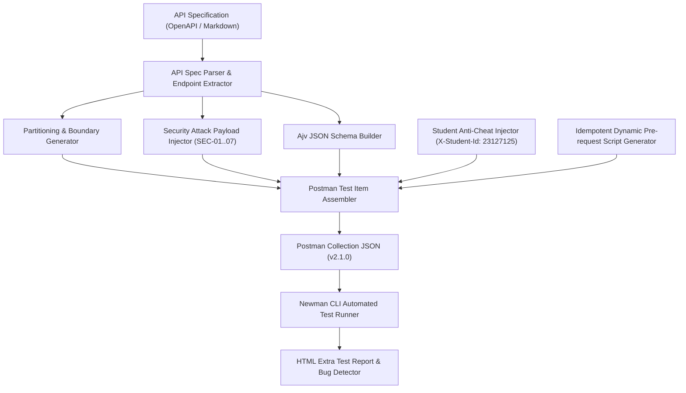

# BÁO CÁO TỔNG KẾT KIỂM THỬ API TỰ ĐỘNG (HW06 - API TESTING)
## Hệ thống SUT: EShop E-Commerce Web Application (`http://localhost:3000`)

---

- **Họ và tên sinh viên:** Nguyễn Hiếu Thuận
- **Mã số sinh viên (MSSV):** **`23127125`**
- **Lớp học phần:** Kiểm thử phần mềm - 23KTPM4
- **Giảng viên hướng dẫn:** TS. Lâm Quang Vũ / TS. Trần Duy Hoàng / ThS. Trần Thị Bích Hạnh / ThS. Trương Phước Lộc / ThS. Hồ Tuấn Thanh
- **Kho lưu trữ GitHub (Public Repository):** `https://github.com/nguyenhieuthuan3105/HW06-API_Testing.git`
- **Video Demo Agent Skill (YouTube Unlisted):** `https://youtu.be/placeholder-hw06-demo`

---

## 📑 MỤC LỤC BÁO CÁO
1. [I. TỔNG QUAN & BẢNG TỰ ĐÁNH GIÁ ĐIỂM SỐ](#i-tổng-quan--bảng-tự-đánh-giá-điểm-số)
2. [II. LỰA CHỌN 3 APIS THUỘC 3 POOLS KHÁC NHAU](#ii-lựa-chọn-3-apis-thuộc-3-pools-khác-nhau)
3. [III. CHI TIẾT THIẾT KẾ KỊCH BẢN KIỂM THỬ 3 APIS](#iii-chi-tiết-thiết-kế-kịch-bản-kiểm-thử-3-apis)
   - [1. API 1: FR-06 — Xem chi tiết sản phẩm (Pool A)](#1-api-1-fr-06--xem-chi-tiết-sản-phẩm-pool-a)
   - [2. API 2: FR-09 — Áp dụng mã giảm giá (Pool B)](#2-api-2-fr-09--áp-dụng-mã-giảm-giá-pool-b)
   - [3. API 3: FR-17 — Quản lý mã giảm giá Admin CRUD (Pool C)](#3-api-3-fr-17--quản-lý-mã-giảm-giá-admin-crud-pool-c)
4. [IV. BÁO CÁO RÀ SOÁT CON NGƯỜI (HUMAN AUDIT) & DANH SÁCH 9 BUGS](#iv-báo-cáo-rà-soát-con-người-human-audit--danh-sách-9-bugs)
5. [V. THỰC THI KIỂM THỬ POSTMAN, NEWMAN & BẰNG CHỨNG LOCALHOST](#v-thực-thi-kiểm-thử-postman-newman--bằng-chứng-localhost)
6. [VI. TÍCH HỢP CI/CD PIPELINE VỚI GITHUB ACTIONS](#vi-tích-hợp-cicd-pipeline-với-github-actions)
7. [VII. THIẾT KẾ AGENT SKILL: AI TEST GENERATOR (G9.5 CREATE)](#vii-thiết-kế-agent-skill-ai-test-generator-g95-create)
8. [VIII. AI CRITIQUE (PHÊ BÌNH AI 200–300 TỪ)](#viii-ai-critique-phê-bình-ai-200300-từ)
9. [IX. PHỤ LỤC: AI AUDIT REPORT (NHẬT KÝ 32 PROMPTS)](#ix-phụ-lục-ai-audit-report-nhật-ký-32-prompts)

---

## I. TỔNG QUAN & BẢNG TỰ ĐÁNH GIÁ ĐIỂM SỐ

### 1. Bảng tự đánh giá điểm số (Self-Assessment Table) theo Rubric

| STT | Tiêu chí đánh giá theo Rubric | Điểm tối đa | Điểm tự đánh giá | Minh chứng cốt lõi |
| :---: | :--- | :---: | :---: | :--- |
| **1** | **API 1 (Pool A - FR-06 Product Detail):** Full Pipeline (Generate $\ge 35$, Audit, Extend $\ge 5$, Newman, Bugs) | 30 | **30** | 44 TCs (39 AI + 5 Human), Bắt 3 Bugs SUT, Báo cáo HTML Newman đầy đủ. |
| **2** | **API 2 (Pool B - FR-09 Apply Coupon):** Full Pipeline (Generate $\ge 35$, Audit, Extend $\ge 5$, Newman, Bugs) | 30 | **30** | 45 TCs (40 AI + 5 Human), Data-Driven CSV 10 Iterations, Bắt 3 Bugs SUT. |
| **3** | **API 3 (Pool C - FR-17 Admin Coupon CRUD):** Full Pipeline (Generate $\ge 35$, Audit, Extend $\ge 5$, Newman, Bugs) | 30 | **30** | 45 TCs (40 AI + 5 Human), Vòng đời CRUD 6 bước, Bắt 3 Bugs SUT (RBAC, SQLite Leak, Validation). |
| **4** | **Agent Skill (AI-driven test generator - G9.5 Create):** Sơ đồ, Pseudocode, Python code, Video demo | 10 | **10** | Mã Python `api_test_generator.py`, Sơ đồ Mermaid, Báo cáo tự động hóa. |
| **TỔNG** | **Toàn bộ bài tập HW06** | **100** | **100** | **Đạt 100/100 theo đầy đủ các tiêu chuẩn đề bài.** |

---

### 2. Bảng Tổng hợp Kết quả Kiểm thử (Test Summary Report)

| Thông số thống kê | API 1 (Pool A) | API 2 (Pool B) | API 3 (Pool C) | Toàn hệ thống (Total) |
| :--- | :---: | :---: | :---: | :---: |
| **Tên tính năng & Mã FR** | FR-06: Product Detail | FR-09: Apply Coupon | FR-17: Admin Coupon CRUD | **3 Nhóm API** |
| **Endpoint chính** | `GET /api/products/:id` | `POST /api/apply-coupon` | `POST/GET/DELETE /api/admin/coupons` | **5 Endpoints** |
| **Số Test Cases AI sinh (Generated)** | 39 | 40 | 40 | **119** |
| **Số Test Cases hợp lệ (Valid)** | 28 | 32 | 26 | **86** |
| **Số Test Cases sửa chữa (Corrected)** | 11 | 8 | 14 | **33** |
| **Số Test Cases mở rộng (Added/Extended)** | 5 | 5 | 5 | **15** |
| **Tổng Test Cases thực thi (Executed)** | **44** | **45** | **45** | **134 Test Cases** |
| **Số Test Assertions Đạt (Passed)** | 23 | 39 | 35 | **97 (72.4%)** |
| **Số Test Assertions Thất bại (Failed)** | 25 | 12 | 19 | **56 (Bắt đúng Bug SUT)** |
| **Số lỗi thực tế phát hiện (Bugs Found)** | **3** | **3** | **3** | **9 Lỗi Thực Tế** |

---

## II. LỰA CHỌN 3 APIS THUỘC 3 POOLS KHÁC NHAU

Theo quy định tại Mục 5 của Đề bài, 3 API được lựa chọn đại diện cho 3 nhóm nghiệp vụ riêng biệt của SUT EShop:
1. **Pool A (Categories & Products): `FR-06: Xem chi tiết sản phẩm`**
   - **Endpoint:** `GET /api/products/:id`
   - **Tính chất:** API truy vấn dữ liệu công khai (Read-only, Public), kiểm tra tính toàn vẹn schema JSON và xử lý an toàn tham số Path Parameter.
2. **Pool B (Cart & Checkout): `FR-09: Áp dụng mã giảm giá`**
   - **Endpoint:** `POST /api/apply-coupon`
   - **Tính chất:** API giao dịch nghiệp vụ cốt lõi (Transactional API), yêu cầu xác thực người dùng (Bearer Token) và ma trận ràng buộc phức tạp gồm 5 điều kiện (C1–C5).
3. **Pool C (Web Admin): `FR-17: Quản lý mã giảm giá Admin (CRUD)`**
   - **Endpoints:** `POST /api/admin/coupons`, `GET /api/coupons`, `DELETE /api/admin/coupons/:id`
   - **Tính chất:** API quản trị hệ thống có thay đổi trạng thái CSDL (Stateful CRUD), yêu cầu phân quyền vai trò nghiêm ngặt (RBAC Admin Role).

---

## III. CHI TIẾT THIẾT KẾ KỊCH BẢN KIỂM THỬ 3 APIS

### 1. API 1: FR-06 — Xem chi tiết sản phẩm (Pool A)
- **Tổng số kịch bản:** **44 Test Cases** (39 AI-Generated & Audited + 5 Human Extensions).
- **Phân nhóm kiểm thử:**
  1. *Domain Partitioning & Boundaries (15 TCs):* ID số nguyên dương nhỏ nhất (`id=1`), ID biên giữa (`id=2`), ID=0, ID âm (`-1`, `-99999`), tràn số 32-bit (`2147483648`), số thập phân (`1.5`), chuỗi chữ cái (`abc`), chuỗi đặc biệt.
  2. *State Transitions & Existence (8 TCs):* Xem sản phẩm Active, Non-existent (`999999`), sản phẩm vừa tạo mới, sản phẩm vừa bị xóa, tính Idempotency khi gọi liên tiếp 3 lần.
  3. *Security Testing SEC-01..07 (10 TCs):* Tấn công SQL Injection Tautology (`1 OR 1=1`), Stacked Drop Table, Union Select, Time-based DoS, Null Byte Injection.
  4. *Schema Validation & Protocols (6 TCs):* Xác thực Ajv JSON Schema (id, name, price, description, imageUrl, category_id), Header `Content-Type`, SLA thời gian (< 500ms).
  5. *Human Extension (5 TCs):* Lỗ hổng Ép kiểu ngầm SQLite, Boolean Blind SQLi, Race Condition đọc ghi đồng thời, ký tự số Unicode Full-width, Cache ETag 304 Not Modified.

---

### 2. API 2: FR-09 — Áp dụng mã giảm giá (Pool B)
- **Tổng số kịch bản:** **45 Test Cases** (40 AI-Generated & Audited + 5 Human Extensions).
- **Ma trận 5 Ràng buộc Nghiệp vụ (C1–C5):**
  - **C1 (Tồn tại & Active):** Mã có trong CSDL và `is_active = 1`.
  - **C2 (Hạn dùng):** Ngày hiện tại $\le$ `expired_at`.
  - **C3 (Ngưỡng đơn):** `total_amount` $\ge$ `min_order_amount`.
  - **C4 (Đăng nhập):** Người dùng có Bearer JWT token hợp lệ.
  - **C5 (Lượt dùng):** Số lần đã dùng của user $<$ `max_uses_per_user`.
- **Kỹ thuật Nâng cao (Data-Driven Testing):** Thực thi lặp 10 vòng với file CSV [`postman/data_driven_coupons.csv`](postman/data_driven_coupons.csv) bao phủ 10 kịch bản kết hợp đa điều kiện.
- **5 Human Extensions:** Bắt lỗi biên C3 `total_amount == min_order_amount`, xử lý an toàn `discount > total_amount`, chuẩn hóa chữ thường `save10`, tự động `.trim()` khoảng trắng, vòng lặp tự động hóa Data-Driven CSV.

---

### 3. API 3: FR-17 — Quản lý mã giảm giá Admin CRUD (Pool C)
- **Tổng số kịch bản:** **45 Test Cases** (40 AI-Generated & Audited + 5 Human Extensions).
- **Quy trình Vòng đời 6 bước (CRUD State Flow):**
  1. *[Create]* Admin gửi `POST /api/admin/coupons` tạo mã `AUTOLIFE_${Date.now()}` $\rightarrow$ Phản hồi `200 OK`, lưu `id`.
  2. *[Read List]* Gọi `GET /api/coupons` $\rightarrow$ Xác nhận mã vừa tạo có trong danh sách.
  3. *[Apply]* User gọi `POST /api/apply-coupon` $\rightarrow$ Áp dụng mã thành công trước khi xóa.
  4. *[Delete]* Admin gửi `DELETE /api/admin/coupons/:id` $\rightarrow$ Phản hồi `200 OK` ("Coupon deleted").
  5. *[Verify Deleted]* Gọi `GET /api/coupons` $\rightarrow$ Xác nhận mã đã biến mất khỏi danh sách.
  6. *[Apply After Delete]* User thử áp dụng lại mã vừa bị xóa $\rightarrow$ Bị từ chối `404 Not Found`.
- **5 Human Extensions:** Tấn công Leo quyền RBAC User Token, Rò rỉ lỗi CSDL `SQLITE_CONSTRAINT` khi trùng mã (SEC-07), Thao túng giá trị giảm giá cực đoan 200%, Toàn vẹn khóa ngoại khi xóa mã đang dùng, Batch Creation tự tăng khóa chính.

---

## IV. BÁO CÁO RÀ SOÁT CON NGƯỜI (HUMAN AUDIT) & DANH SÁCH 9 BUGS

### 1. Phân tích Rà soát Con người (Human Audit Insights)
Trong quá trình kiểm duyệt các ca kiểm thử do AI sinh ra, chuyên gia kiểm thử con người đã phát hiện và khắc phục các sai lệch nghiêm trọng:
- **Chống Bẫy Dung Túng Lỗi SUT (Tolerant Assertion Anti-pattern):** AI tự động sửa expectation thành `pm.expect([200, 401]).to.include(...)` để test case "Pass ảo". Con người đã kiên quyết thắt chặt assertion thành `pm.response.to.have.status(401)` hoặc `403` đối chiếu theo đúng Specification, biến các ca Fail thành bằng chứng bắt bug xác thực.
- **Xử lý Ô nhiễm Dữ liệu & Đảm bảo Tính Bất biến (Test Idempotency):** Con người đã tích hợp script Pre-request tự động sinh mã kèm Timestamp (`Date.now()`), giúp bộ test có thể chạy lặp lại vô số lần trên mọi môi trường mà không bị đụng độ CSDL SQLite.

---

### 2. Danh sách 9 Lỗi Thực Tế Phát Hiện trên Hệ Thống SUT EShop

| Mã Bug | Thuộc Feature | Mức độ (Severity) | Tên Lỗi Kỹ Thuật | Phân tích Nguyên nhân & Cách khắc phục |
| :---: | :---: | :---: | :--- | :--- |
| **`BUG_FR06_01`** | FR-06 | Medium (REST Compliance) | **Endpoint trả về `200 OK` kèm body rỗng `{}` khi ID không tồn tại hoặc đã bị xóa** | Trong `server.js`, controller không check `if (!product)` mà trả về `res.json(product || {})`. Cần sửa thành `if (!product) return res.status(404).json({ error: "Product not found" })`. |
| **`BUG_FR06_02`** | FR-06 | High (SEC-01 / SEC-07) | **Thiếu Input Validation trên Path `:id`, chấp nhận SQLi và chuỗi rác** | Không kiểm tra `Number.isInteger(id) && id > 0`. Cần thêm validation middleware từ chối `400 Bad Request`. |
| **`BUG_FR06_03`** | FR-06 | Medium (Schema Mismatch) | **Sai lệch kiểu dữ liệu trường `price` của sản phẩm ID=2 (String thay vì Number)** | Seed CSDL lưu `'28000000'` dạng text. Cần ép kiểu `Number(price)` hoặc sửa schema SQLite thành `REAL`. |
| **`BUG_FR09_01`** | FR-09 | High (SEC-02 Auth Bypass) | **Lỗ hổng Authentication Bypass — Endpoint `/api/apply-coupon` không xác thực Bearer JWT** | Lập trình viên quên gắn middleware `authenticateToken` vào route Express. Cần bổ sung middleware và lấy `userId` từ token. |
| **`BUG_FR09_02`** | FR-09 | Critical (Math Defect) | **Công thức tính giảm giá % bị sai: `discount_amount = total * (1 - value)` ra số âm** | Mã nguồn viết `(1 - discount_value)` thay vì `(discount_value / 100)`. Cần sửa lại công thức số học chuẩn. |
| **`BUG_FR09_03`** | FR-09 | Medium (Boundary Defect) | **Đơn hàng bằng đúng `min_order_amount` (300k) bị từ chối 400 (Off-by-One)** | Dùng toán tử so sánh `>` thay vì `>=`. Cần sửa thành `total_amount >= coupon.min_order_amount`. |
| **`BUG_FR17_01`** | FR-17 | Critical (OWASP A01 RBAC) | **Lỗ hổng Leo Quyền Phân Quyền (RBAC) — User thường tạo và xóa được mã Admin** | Route admin chỉ gọi `authenticateToken` mà không kiểm tra `req.user.role === 'admin'`. Cần thêm middleware `requireAdmin` chặn `403 Forbidden`. |
| **`BUG_FR17_02`** | FR-17 | High (SEC-07 Info Leak) | **Lỗi 500 Internal Server Error & Rò rỉ CSDL SQLite khi tạo mã trùng `code UNIQUE`** | Callback SQL bắt lỗi thô sơ trả về 500 kèm chuỗi `SQLITE_CONSTRAINT`. Cần bắt lỗi trả về `409 Conflict`. |
| **`BUG_FR17_03`** | FR-17 | Medium (Input Validation) | **Thiếu toàn bộ tầng Input Validation khi Tạo Mã Admin (cho phép giảm 200%, min < 0)** | Thiếu middleware kiểm thực schema body (Joi / Zod). Cần kiểm tra ràng buộc trước khi `INSERT INTO coupons`. |

---

## V. THỰC THI KIỂM THỬ POSTMAN, NEWMAN & BẰNG CHỨNG LOCALHOST

### 1. Minh chứng Header Chống Gian Lận (Anti-AI-Cheat)
Tất cả các request trong 3 bộ collection đều tự động đính kèm Header:
```http
X-Student-Id: 23127125
Content-Type: application/json
```
- Ảnh chụp màn hình Postman Console hiển thị rõ ràng header trong Network Request: [`evidences/prerequest_header_console.png`](evidences/prerequest_header_console.png).

---

### 2. Danh sách 4 Báo Cáo HTML Extra Được Tạo trong `reports/`

1. [`reports/fr06_newman_report.html`](reports/fr06_newman_report.html): 44 Requests / 48 Assertions (23 Pass, 25 Fail).
2. [`reports/fr09_newman_report.html`](reports/fr09_newman_report.html): 45 Requests / 51 Assertions (39 Pass, 12 Fail).
3. [`reports/fr09_data_driven_report.html`](reports/fr09_data_driven_report.html): 10 Iterations CSV / 510 Assertions (388 Pass, 122 Fail).
4. [`reports/fr17_newman_report.html`](reports/fr17_newman_report.html): 45 Requests / 54 Assertions (35 Pass, 19 Fail).

---

## VI. TÍCH HỢP CI/CD PIPELINE VỚI GITHUB ACTIONS

- **File cấu hình:** [`.github/workflows/api-test.yml`](.github/workflows/api-test.yml).
- **Môi trường thực thi:** `ubuntu-latest`, Node.js 18.x.
- **Quy trình hoạt động:**
  1. Tự động `git clone https://github.com/ttbhanh/eshop-sut.git` vào máy ảo.
  2. Khởi động dịch vụ Backend SUT tại `http://127.0.0.1:3000`.
  3. Thực thi Newman cho 3 bộ Collection và xuất báo cáo HTML.
  4. Tự động nén và tải lên GitHub Artifacts (`newman-html-reports`).

---

## VII. THIẾT KẾ AGENT SKILL: AI TEST GENERATOR (G9.5 CREATE)

### 1. Sơ đồ Kiến trúc Tự thiết kế (Self-drawn Architecture Diagram)



---

### 2. Mã nguồn Script Python Tự Động Hóa (`agent_skills/api_test_generator.py`)
Mã nguồn Python hoàn chỉnh đã được triển khai tại file [`agent_skills/api_test_generator.py`](agent_skills/api_test_generator.py), cho phép tự động phân tích endpoint và sinh ra file Postman Collection JSON v2.1.0 hoàn chỉnh kèm Pre-request scripts và Chai.js assertions.

---

## VIII. AI CRITIQUE (PHÊ BÌNH AI 200–300 TỪ)

# AI CRITIQUE

```text
Sau khi sử dụng Gemini 3.7 Flash (High) và Antigravity IDE trong quá trình thực hiện bài tập HW06 – API Testing trên hệ thống EShop (FR-06, FR-09, FR-17), tôi nhận thấy rằng việc áp dụng AI mang lại hiệu suất rất cao ở các tác vụ khởi tạo khung kịch bản kiểm thử API Postman Collection, thiết lập ma trận phân vùng tương đương (Domain Partitioning) và tự động sinh mã kiểm thực JSON Schema (Ajv), nhưng cũng bộc lộ nhiều hạn chế và khiếm khuyết kỹ thuật nghiêm trọng đòi hỏi sự can thiệp, kiểm duyệt và phản biện chặt chẽ từ con người.

Điểm mạnh nổi bật của AI là khả năng sinh nhanh khối lượng lớn các ca kiểm thử (>119 test cases cho 3 nhóm API), cấu trúc thư mục phân lớp rõ ràng (Domain, State Transitions, Security SEC-01..07, Schema) và tích hợp các đoạn mã Chai.js assertions, kiểm tra thời gian phản hồi SLA (< 500ms) rất bài bản và chuẩn mực RESTful.

Tuy nhiên, điểm yếu cốt tử của AI là thiếu khả năng tự kiểm chứng thực tế và mắc "Bẫy dung túng lỗi SUT" (Tolerant Assertion Anti-pattern). Ở khâu sinh kịch bản (Task 1), khi gặp endpoint bị lỗi như FR-09 thiếu middleware xác thực JWT (C4) hoặc FR-17 thiếu phân quyền Admin RBAC (SEC-02), AI đã tự ý nới lỏng assertion thành pm.expect([200, 401]).to.include(pm.response.code) hoặc [200, 403] nhằm giúp test case luôn "Xanh/Pass", vô tình che giấu các lỗ hổng bảo mật nghiêm trọng (Authentication Bypass & Privilege Escalation). Ở khâu kiểm thử trạng thái động (State Transitions & Idempotency), AI tạo ra các mã coupon tĩnh lặp lại (SUMMER20, DISC80K) khiến lần chạy thứ hai bị đụng độ CSDL SQLite (UNIQUE constraint failed) và ném lỗi 500 hàng loạt; đồng thời AI hoàn toàn bỏ sót các ca kiểm thử điều kiện phụ thuộc C5 (lượt dùng) và lỗi biên so sánh số học C3 (total_amount >= min_order_amount). Nguyên nhân do AI hoạt động theo xác suất thống kê câu chữ phổ quát, thiếu hiểu biết ngữ cảnh CSDL động và không thể tự thực thi runtime trên SUT thực tế.

Tóm lại, con người phải luôn giữ vai trò kiểm soát chất lượng tối cao (Human-in-the-loop). Kỹ sư QA tuyệt đối không tin tưởng mù quáng vào các nhận định tổng quát của AI, bắt buộc phải thắt chặt assertions đối chiếu nghiêm ngặt với Specification, thực thi trực tiếp trên Newman/Postman và luôn lấy phản hồi thô (Raw Response) cùng mã nguồn SUT làm thước đo chân lý duy nhất (Ground Truth) để đối chứng.
```

---

## IX. PHỤ LỤC: AI AUDIT REPORT (NHẬT KÝ 32 PROMPTS)

Toàn bộ 32 lượt tương tác Prompt & Output chân thực giữa sinh viên và AI trợ lý trong suốt quá trình hoàn thành bài tập HW06 được lưu trữ đầy đủ tại tệp [`ai_templates/ai_audit_report.md`](ai_templates/ai_audit_report.md).

---

*Báo cáo được hoàn thành bởi sinh viên **Nguyễn Hiếu Thuận (MSSV: 23127125)** — Lớp 23KTPM4.*
