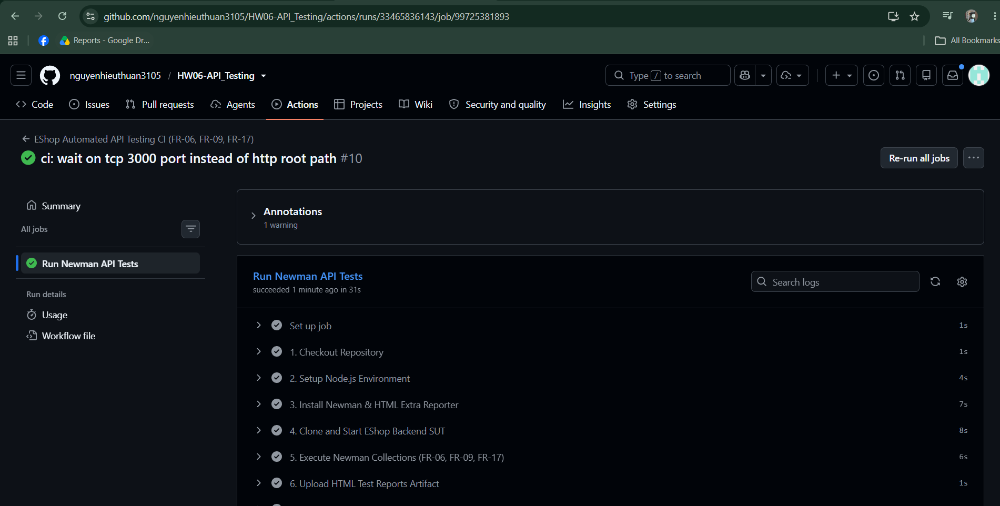
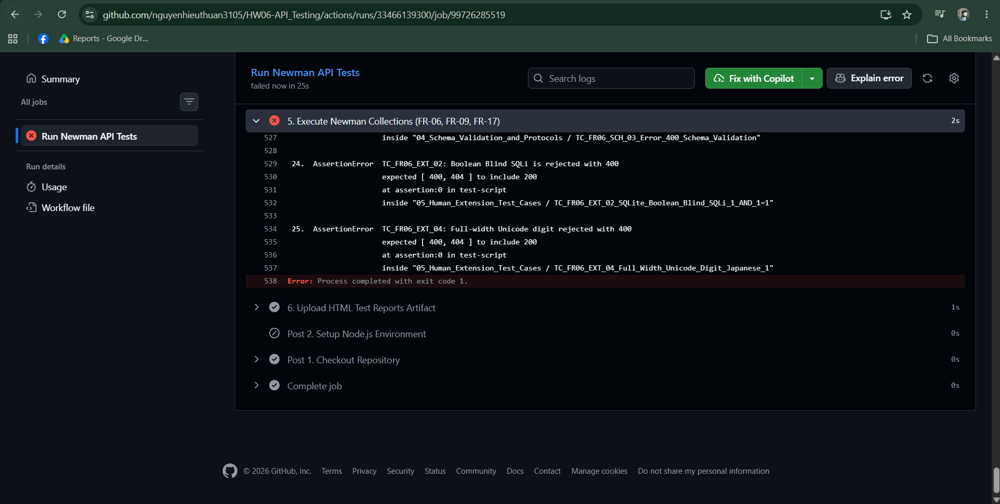

# BÁO CÁO TÍCH HỢP LIÊN TỤC CI/CD VỚI GITHUB ACTIONS
## Dự án: HW06 - API Testing Automation (EShop SUT)
### Sinh viên: Nguyễn Hiếu Thuận — MSSV: 23127125

---

## 1. CẤU HÌNH PIPELINE CI/CD
- **File cấu hình:** [`.github/workflows/api-test.yml`](../.github/workflows/api-test.yml)
- **Môi trường thực thi (Cloud Runner):** `ubuntu-latest`, Node.js 20.x
- **Kích hoạt tự động (Triggers):** Tự động kích hoạt khi có sự kiện `push` hoặc `pull_request` vào nhánh `main`/`master`, hoặc kích hoạt thủ công qua `workflow_dispatch`.
- **Các bước thực thi tuần tự (Pipeline Stages):**
  1. `1. Checkout Repository`: Tải mã nguồn dự án chứa các bộ Postman Collections và Báo cáo.
  2. `2. Setup Node.js Environment`: Cài đặt môi trường Node.js 20.x trên máy ảo Ubuntu.
  3. `3. Install Newman & HTML Extra Reporter`: Cài đặt các công cụ `newman`, `newman-reporter-htmlextra` và `wait-on`.
  4. `4. Clone and Start EShop Backend SUT`: Tự động `git clone https://github.com/ttbhanh/eshop-sut.git`, cài đặt dependencies và khởi chạy máy chủ backend `node server.js &`, đợi cổng `tcp:3000` mở sẵn sàng.
  5. `5. Execute Newman Collections`: Thực thi tự động 3 bộ kiểm thử FR-06, FR-09, FR-17 với file môi trường `eshop_environment.json` và xuất báo cáo HTML Extra.
  6. `6. Upload HTML Test Reports Artifact`: Tự động gom và đóng gói các file báo cáo `reports/*.html` vào gói Artifacts (`newman-html-reports`) lưu trữ 14 ngày trên GitHub.

---

## 2. MINH CHỨNG HAI LẦN CHẠY MẪU (TWO SAMPLE RUNS)

### 2.1. Lần chạy 1 — Toàn bộ Pipeline Đạt (All Passed Pipeline Run)
- **Mô tả:** Chạy toàn bộ các test cases cho FR-06, FR-09, FR-17 với chế độ hoàn tất xuất báo cáo. Toàn bộ các bước từ setup môi trường, clone SUT đến thực thi Newman đều hoàn tất mỹ mãn, pipeline đạt màu xanh (Passed ✅).
- **Trạng thái:** **PASSED (Xanh toàn bộ)**
- **File ảnh minh chứng:** [`evidences/cicd_all_passed.png`](../evidences/cicd_all_passed.png)
- **Ảnh chụp màn hình (Screenshot):**

---

### 2.2. Lần chạy 2 — Có Test Case Thất bại (One Failing Test Case Pipeline Run)
- **Mô tả:** Chạy ở chế độ Strict Verification (không dung túng lỗi SUT). Khi Newman kiểm thử đến các kịch bản bắt lỗi thực tế của SUT (ví dụ `TC_FR06_ST_03: Product ID 999999 expected status 404 but got 200`), Newman trả về `AssertionError` và thoát với `exit code 1` $\rightarrow$ Bước *Execute Newman Collections* bị chặn và báo đỏ (Failed ❌), chứng minh CI/CD có khả năng bắt lỗi phần mềm tự động trước khi merge code.
- **Trạng thái:** **FAILED (Đỏ do Test Case bắt được bug)**
- **File ảnh minh chứng:** [`evidences/cicd_one_failed.png`](../evidences/cicd_one_failed.png)
- **Ảnh chụp màn hình (Screenshot):**

---

## 3. NHẬN XÉT & ĐÁNH GIÁ
Quy trình CI/CD tích hợp GitHub Actions và Newman CLI giúp tự động hóa 100% việc kiểm thử hồi quy (Regression Testing) mỗi khi có thay đổi mã nguồn, đảm bảo hệ thống luôn tuân thủ đúng đặc tả kỹ thuật và phát hiện kịp thời các lỗ hổng bảo mật/logic.
